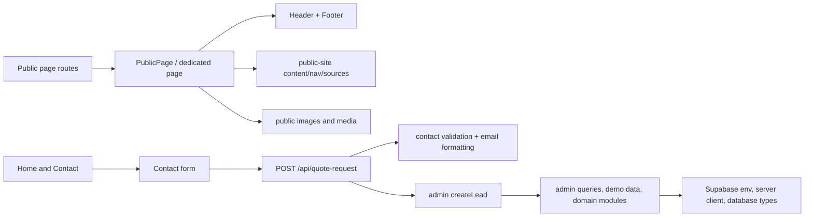

# Production Cleanup Dependency Analysis

**Date:** 2026-07-16  
**Status:** Phases 1 and 2 complete; analysis only  
**Approval boundary:** No application code, route, dependency, schema, configuration, or asset has been removed as part of this analysis.

## Executive finding

The public marketing site is already separated well enough to support a focused cleanup, but one important dependency must be broken first: `POST /api/quote-request` imports `createLead` from the admin query layer. That one import pulls 30 CRM, demo-data, Supabase, and database-type files into an otherwise public feature. The quote route can remain fully functional by sending email through its existing Resend HTTP integration and removing the best-effort CRM write.

The current tracked tree contains 840 files and 141.83 MiB. Application source accounts for 286 files and 41,592 lines. The proposed default cleanup, before the Blog decision, identifies:

- 229 source files and approximately 34,970 source lines that are removable after the quote endpoint is decoupled.
- 59 route entries that are removable: 49 admin entries, 7 authentication/portal entries, and 3 development or planning-tool entries.
- All 26 dynamic route templates, because every dynamic route belongs to admin, client portal, or vendor portal functionality.
- 355 currently unreferenced marketing assets totaling approximately 90.46 MiB.
- 5 operations-specific runtime dependencies/dev dependencies plus 2 independently unused packages.
- The entire 23-migration Supabase schema, seed, local configuration, auth proxy, generated database types, and Supabase-specific agent tooling.

The retained target is 28 public pages plus the quote API. `/blog` would make that 29 public pages if the owner elects to retain it.

## Audit method and scope

This analysis used the current working tree and did not assume that a path was required merely because it existed.

1. Enumerated all tracked files, all `src/app` route conventions, layouts, route handlers, Server Actions, components, libraries, tests, static assets, migrations, documentation, and top-level configuration.
2. Parsed static TypeScript imports for 285 `.ts`/`.tsx` files and calculated transitive route closures.
3. Searched JSX/data files for navigation targets, programmatic redirects, form endpoints, image paths, environment variables, and package imports.
4. Compared literal public-asset references against the 419 files under `public/images`.
5. Checked package usage in source and tooling.
6. Reviewed Supabase migrations by feature and traced the public quote request through the database layer.
7. Used the existing source and runtime audits as corroborating evidence, while treating repository source as the dependency source of truth.

Generated build output (`.next`, `out`), dependency installs (`node_modules`, `.ds-sync/node_modules`), Git objects, and ignored local caches are not application source. They are recorded separately so they do not distort the tracked-repository baseline.

In the tables below, a glob row is a per-file decision applying identically to every matched file. Counts are provided so the coverage can be reconciled against the repository inventory.

## Baseline repository facts

| Measure | Current value | Evidence |
|---|---:|---|
| Tracked files | 840 | `git ls-files` |
| Tracked logical size | 141.83 MiB | Sum of tracked file sizes; excludes `.git`, dependencies, and build output |
| Application files | 286 | `src/app` 123; `src/components` 46; `src/lib` 115; `src/proxy.ts` 1; `src/types` 1 |
| Application source lines | 41,592 | `.ts`, `.tsx`, and `globals.css` |
| Route entries | 89 | 81 page files and 8 route handlers |
| Public page files | 32 | Includes `/blog`, `/estimate`, `/project-timelines`, and `/demo-slider` |
| Admin route entries | 49 | 43 pages and 6 handlers |
| Auth/client/vendor route entries | 7 | 6 pages and `/auth/callback` |
| Dynamic route templates | 26 | All are admin/client/vendor routes |
| Server Action files | 28 | 23 admin, 5 login/client/vendor |
| Tests | 52 files / 194 tests | Current Vitest run |
| Static image/media files | 419 / 121.78 MiB | `public/images` |
| Supabase migrations | 23 | `supabase/migrations` |
| Runtime audit screenshots | 345 / approximately 118 MiB | Untracked `docs/runtime-site-audit/screenshots` |

### Tracked-file coverage reconciliation

This is the 840-file baseline before the two cleanup documents were added:

| Tracked area | Files | Where classified below |
|---|---:|---|
| `public/**` | 429 | Static assets ledger |
| `src/**` | 286 | App, component, and library ledgers |
| `.agents/**` | 38 | Documentation/tooling ledger |
| `supabase/**` | 26 | Supabase/database ledger |
| `.design-sync/**` | 13 | Documentation/tooling ledger |
| `docs/**` | 11 | Documentation/tooling ledger |
| `Kiefer-Built-platform-screenshots/**` | 8 | Documentation/tooling ledger |
| `.sessions/**` | 8 | Documentation/tooling ledger |
| `scripts/**` | 1 | Documentation/tooling ledger |
| Top-level tracked files | 20 | Packages, environment/configuration, docs, and collateral ledgers |
| **Total** | **840** | All tracked files covered |

The untracked runtime audit adds 345 screenshots, 2 report/inventory files, and 1 session handoff. Those pre-existing files are protected as dirty worktree content and are not counted in the tracked baseline.

Source disposition also reconciles exactly:

| Source area | KEEP / modify | UNSURE | REMOVE | Total |
|---|---:|---:|---:|---:|
| `src/app/**` | 32 | 1 (`/blog`) | 90 | 123 |
| `src/components/**` | 10 | 0 | 36 | 46 |
| `src/lib/**` | 14 | 0 | 101 | 115 |
| `src/proxy.ts` | 0 | 0 | 1 | 1 |
| `src/types/**` | 0 | 0 | 1 | 1 |
| **Total** | **56** | **1** | **229** | **286** |

## Framework and runtime that remain necessary

- Next.js 16 App Router and React 19 remain required.
- The site cannot become a pure static export while the quote form posts to the server-side `/api/quote-request` handler.
- Tailwind CSS 4, Framer Motion, Lucide React, and the lightbox package remain used by public UI.
- Zod remains used for quote-request validation.
- `@next/third-parties` remains used for Google Analytics.
- Resend is called directly over HTTP; there is no Resend SDK dependency to retain or remove.
- Supabase is not required after the quote route stops creating CRM leads.

## Route classification

### Public marketing routes

| Route | Source file | Classification | Dependency finding |
|---|---|---|---|
| `/` | `src/app/page.tsx` | **KEEP** | Marketing front door; uses Header, Footer, Contact, public images, Framer Motion indirectly, and quote API. |
| `/about` | `src/app/about/page.tsx` | **KEEP** | Thin `PublicPage` wrapper over `publicPages.about`. |
| `/about/team` | `src/app/about/team/page.tsx` | **KEEP** | Required team page and four team portraits. |
| `/about/accolades` | `src/app/about/accolades/page.tsx` | **KEEP** | Trust/awards page; owner verification of claims remains a content task. |
| `/blog` | `src/app/blog/page.tsx` | **KEEP** | Retained as a curated landing page whose cards now lead to complete education and project destinations. |
| `/careers` | `src/app/careers/page.tsx` | **KEEP** | Public recruitment page using mailto/contact CTAs. |
| `/contact` | `src/app/contact/page.tsx` | **KEEP** | Standalone public quote form. |
| `/demo-slider` | `src/app/demo-slider/page.tsx` | **REMOVE** | Explicit developer demo; direct-URL-only; depends on unused slider components. |
| `/estimate` | `src/app/estimate/page.tsx` | **REMOVE** | Direct-URL-only calculator with hard-coded per-square-foot rates and multipliers; not part of approved scope and requires factual maintenance. |
| `/flipbook` | `src/app/flipbook/page.tsx` | **KEEP** | Project lookbook in primary navigation. It is not the Homeowner Guide. |
| `/process` | `src/app/process/page.tsx` | **KEEP + EDIT** | Required process page; current copy still promises “client portal communication.” |
| `/products` | `src/app/products/page.tsx` | **KEEP** | Public product/finish partner page and incoming link to `/vendors`. |
| `/project-timelines` | `src/app/project-timelines/page.tsx` | **REMOVE** | Direct-URL-only utility with hard-coded durations and price ranges; the approved `/process` page is the appropriate replacement. |
| `/projects` | `src/app/projects/page.tsx` | **KEEP + WIRE** | Required gallery hub; currently does not link two existing detailed project pages. |
| `/projects/commercial` | `src/app/projects/commercial/page.tsx` | **KEEP** | Required commercial portfolio page. |
| `/projects/contemporary-ranch` | `src/app/projects/contemporary-ranch/page.tsx` | **KEEP + WIRE** | High-value detailed project page; direct-URL-only in current marketing graph. |
| `/projects/mountain-modern` | `src/app/projects/mountain-modern/page.tsx` | **KEEP + WIRE** | High-value detailed project/video page; direct-URL-only in current marketing graph. |
| `/projects/new-builds` | `src/app/projects/new-builds/page.tsx` | **KEEP** | Required custom-home portfolio category. |
| `/projects/renovations-additions` | `src/app/projects/renovations-additions/page.tsx` | **KEEP** | Required renovations showcase and interactive carousel. |
| `/service-areas` | `src/app/service-areas/page.tsx` | **KEEP + WIRE** | Relevant local-SEO page; currently direct-URL-only. |
| `/services` | `src/app/services/page.tsx` | **KEEP** | Required services hub. |
| `/services/home-building` | `src/app/services/home-building/page.tsx` | **KEEP** | Required custom-home service page. |
| `/services/custom-elevators` | `src/app/services/custom-elevators/page.tsx` | **KEEP** | Explicitly required specialty-service page. |
| `/testimonials` | `src/app/testimonials/page.tsx` | **KEEP** | Required trust content. |
| `/vendors` | `src/app/vendors/page.tsx` | **KEEP** | Public vendor-information page; uses a mailto form and is distinct from the authenticated singular `/vendor` portal. |
| `/why-kiefer-built` | `src/app/why-kiefer-built/page.tsx` | **KEEP** | Education hub, citations, and Homeowner Guide download configuration. |
| `/why-kiefer-built/sips` | `src/app/why-kiefer-built/sips/page.tsx` | **KEEP** | Education/citation page. |
| `/why-kiefer-built/energy-efficiency` | `src/app/why-kiefer-built/energy-efficiency/page.tsx` | **KEEP** | Education/citation page. |
| `/why-kiefer-built/indoor-air-quality` | `src/app/why-kiefer-built/indoor-air-quality/page.tsx` | **KEEP** | Education/citation page. |
| `/why-kiefer-built/built-for-colorado` | `src/app/why-kiefer-built/built-for-colorado/page.tsx` | **KEEP** | Education/citation page. |
| `/why-kiefer-built/quality` | `src/app/why-kiefer-built/quality/page.tsx` | **KEEP** | Education/citation page. |
| `/why-kiefer-built/cost-of-ownership` | `src/app/why-kiefer-built/cost-of-ownership/page.tsx` | **KEEP** | Education/citation page and Homeowner Guide download configuration. |
| `POST /api/quote-request` | `src/app/api/quote-request/route.ts` | **KEEP + DECOUPLE** | Required lead-generation endpoint; remove CRM write, retain validation, honeypot, email delivery, and error fallback. |

### Entire route surfaces to remove

| Route surface | Source files | Count | Classification | Reason |
|---|---|---:|---|---|
| `/admin/**` | `src/app/admin/**` | 73 files; 49 route entries | **REMOVE** | Admin dashboard and all operations modules are outside the new product. |
| `/login` | `src/app/login/**` | 4 files; 1 page | **REMOVE** | Admin authentication has no retained consumer. |
| `/portal`, `/portal/login`, `/portal/projects/[projectId]` | `src/app/portal/**` | 5 files; 3 pages | **REMOVE** | Client portal and approval actions are explicitly out of scope. |
| `/vendor`, `/vendor/login` | `src/app/vendor/**` | 4 files; 2 pages | **REMOVE** | Authenticated trade-partner portal is out of scope; public `/vendors` remains. |
| `/auth/callback` | `src/app/auth/callback/route.ts` | 1 handler | **REMOVE** | Shared Supabase auth callback has no consumer after the three authenticated surfaces are removed. |
| Admin auth proxy | `src/proxy.ts` | 1 proxy | **REMOVE** | Matcher protects only `/admin/:path*`; no middleware is needed when admin routes are gone. |

## Critical dependency boundary

The normal public-page dependency shape is small:

The red-removal boundary is the `API -> CRM` edge. The full current transitive closure of the quote route is 34 source files:

- `src/app/api/quote-request/route.ts`
- Three contact modules: `process-quote-request.ts`, `quote-request.ts`, `quote-email.ts`
- 27 `src/lib/admin` modules reached through `queries.ts`
- `src/lib/supabase/env.ts`, `server.ts`, and `database.types.ts`

Removing `createLead`, `LeadCreateInput`, `buildQuoteRequestLeadInput`, and the returned `leadId` reduces that route to the contact modules and the Resend fetch. This must occur and pass tests before deleting admin/Supabase code.

## Feature classification

| Feature | Decision | Evidence and rationale |
|---|---|---|
| Marketing home page | **KEEP** | Core acquisition page with project proof, services, education, and quote form. |
| About / team / accolades | **KEEP** | Core company, trust, and leadership messaging. |
| Services / home building / custom elevators | **KEEP** | Explicit required public services. |
| Why Kiefer Built education | **KEEP** | Seven cited, content-driven pages central to buyer education. |
| Homeowner Guide | **KEEP, ASSET BLOCKED** | Content and conditional download UI exist; `public/guides/kiefer-built-homeowner-guide.pdf` does not. |
| Project hub and category pages | **KEEP** | Core portfolio structure. |
| Detailed Mountain Modern and Contemporary Ranch cases | **KEEP + WIRE** | Strong marketing proof; source exists but current UI does not link to them. |
| Renovations showcase | **KEEP** | Explicit scope; interactive public component and referenced project assets. |
| Project lookbook (`/flipbook`) | **KEEP** | Public portfolio content in primary navigation; separate from the Homeowner Guide. |
| Testimonials | **KEEP** | Core credibility content; the broken external review CTA is removed. |
| Public vendor information (`/vendors`) | **KEEP** | Public supplier-intake mailto workflow; no database dependency. |
| Careers | **KEEP** | Public recruiting content with mailto/contact paths. |
| Service areas | **KEEP + WIRE** | Marketing/SEO relevance; needs an incoming UI link. |
| Quote request | **KEEP + MODIFY** | Lead generation is required; must become email-only. |
| Resend email delivery | **KEEP** | Only retained server-side integration. |
| Google Analytics | **KEEP** | Active in root layout through `@next/third-parties`. |
| SEO metadata / structured data / sitemap | **KEEP + REPAIR** | Root metadata is required, but sitemap lists only `/`, all pages inherit the home canonical unless overridden, and structured data still mentions BuilderTrend. |
| Blog | **KEEP** | Landing contains four dated cards that now lead to complete education and project destinations. |
| Cost estimator (`/estimate`) | **REMOVE** | Unlinked, unapproved utility with hard-coded pricing assumptions. |
| Project timeline utility | **REMOVE** | Unlinked, duplicated by Process, and contains unverified schedule/cost claims. |
| Before/after developer demo | **REMOVE** | Explicit demo route and unused component family. |
| Legacy homepage components | **REMOVE** | Nineteen production components are unreachable from every route. |
| Admin dashboard / command center | **REMOVE** | Explicitly out of scope. |
| CRM and lead management | **REMOVE** | Explicitly out of scope; quote email replaces its only public dependency. |
| Proposals and internal PDFs | **REMOVE** | Internal operations feature; releases `@react-pdf/renderer`. |
| Project management / schedule / tasks | **REMOVE** | Explicitly out of scope. |
| Daily logs / comments / updates / RFIs | **REMOVE** | Explicitly out of scope. |
| Selections / change orders / warranty | **REMOVE** | Explicitly out of scope. |
| Invoices / bills / purchase orders / finance / reports / time | **REMOVE** | Explicitly out of scope. |
| Internal files / photos / submittals | **REMOVE** | Operations storage workflows are out of scope; public project photography remains. |
| Land Lead Finder | **REMOVE** | Entire county CSV/scoring/export feature is unrelated to the public website. |
| Client portal | **REMOVE** | Explicitly out of scope. |
| Authenticated vendor portal | **REMOVE** | Explicitly out of scope; does not affect public `/vendors`. |
| Authentication / authorization | **REMOVE** | No retained authenticated route. |
| Supabase database/auth/storage | **REMOVE** | No retained consumer after quote decoupling. |
| Demo mode and demo data | **REMOVE** | Operations-only and currently increases accidental route exposure risk. |
| Design-sync package/export tooling | **REMOVE** | Not used by the production runtime or ongoing content workflow; generated output currently breaks whole-repo lint. |
| Supabase agent skills/MCP config | **REMOVE** | Tooling is specific to the database being removed. |
| Runtime/source audits | **UNSURE / RETAIN TEMPORARILY** | Needed for the planned old-site comparison; screenshot corpus is large and should not be committed without an explicit retention decision. |

## Complete file dependency ledger

### `src/app` — 123 files accounted for

| File | Purpose | Used? | Imported? | Required? | Can safely remove? | Dependencies | Reason |
|---|---|---|---|---|---|---|---|
| `src/app/layout.tsx` | Root metadata, JSON-LD, fonts, analytics, floating CTA | Yes, every route | Next layout entry | **Yes; edit** | No | Next Metadata, Google Analytics, `globals.css`, `GlobalFloatingAction` | Retain shell; remove BuilderTrend preconnect/FAQ text and stale portal assumptions. |
| `src/app/globals.css` | Tailwind import, theme tokens, shared animation/utilities | Yes | Imported by root layout | **Yes** | No | Tailwind 4 | Shared public styling. Audit selectors after route/component deletion. |
| `src/app/page.tsx` | Home page | Yes | Next page entry | **Yes** | No | Header, Footer, Contact, images, Lucide | Core marketing funnel. |
| `src/app/about/{page.tsx,team/page.tsx,accolades/page.tsx}` | Company, team, trust pages | Yes | Next page entries | **Yes** | No | PublicPage/content | Required scope. |
| `src/app/{careers,contact,flipbook,process,products,service-areas,testimonials,vendors}/page.tsx` | Required public pages | Yes | Next page entries | **Yes** | No | Public components/content/images | Required scope; Process and service-area links need edits. |
| `src/app/services/{page.tsx,home-building/page.tsx,custom-elevators/page.tsx}` | Public service hub and detail pages | Yes | Next page entries | **Yes** | No | PublicPage or dedicated shell | Required scope. |
| `src/app/projects/{page.tsx,commercial/page.tsx,contemporary-ranch/page.tsx,mountain-modern/page.tsx,new-builds/page.tsx,renovations-additions/page.tsx}` | Portfolio hub, categories, and two case studies | Yes | Next page entries | **Yes** | No | PublicPage, RanchGallery, RenovationsShowcase, lightbox, media | Required scope; detailed cases need incoming links. |
| `src/app/projects/mountain-modern/layout.tsx` | Project metadata and JSON-LD | Yes | Nested Next layout | **Yes** | No | Next Metadata | Required by the retained case study. |
| `src/app/why-kiefer-built/{page.tsx,sips/page.tsx,energy-efficiency/page.tsx,indoor-air-quality/page.tsx,built-for-colorado/page.tsx,quality/page.tsx,cost-of-ownership/page.tsx}` | Education series | Yes | Next page entries | **Yes** | No | PublicPage/content/sources | Required scope. |
| `src/app/api/quote-request/route.ts` | Validate and email public quote request | Yes | Called by Contact form | **Yes; refactor first** | No | Contact modules; currently admin queries/Supabase | Sole public-to-CRM dependency. |
| `src/app/blog/page.tsx` | Journal landing | Yes via nav | Next page entry | **Decision** | Yes if Blog is not retained | PublicPage and `publicPages.blog` | No article destinations exist. |
| `src/app/estimate/page.tsx` | Hard-coded project-cost calculator | Direct URL only | Next page entry | No | **Yes** | Header, Footer, Lucide, public images | Not approved scope; unverified pricing. |
| `src/app/project-timelines/page.tsx` | Hard-coded project timeline/cost utility | Direct URL only | Next page entry | No | **Yes** | React/Link only | Duplicates Process and carries unverified claims. |
| `src/app/demo-slider/page.tsx` | Before/after component demo | Direct URL only | Next page entry | No | **Yes** | BeforeAfterExample | Development-only. |
| `src/app/admin/**` (73 files) | 43 admin pages, 23 Server Actions, 6 handlers, 1 layout | Yes if direct URL | Next entries/internal imports | No | **After quote refactor** | Admin components/libs, Supabase, React PDF, land leads | Entire surface is outside product scope. |
| `src/app/login/**` (4 files) | Admin login/actions/password component test | Yes if direct URL | Next entry/auth imports | No | **After admin removal** | Admin auth, Supabase | No retained admin consumer. |
| `src/app/portal/**` (5 files) | Client login/dashboard/project/actions | Yes if direct URL | Next entries/auth imports | No | **Yes** | Client auth/portal, admin queries, Supabase | Explicitly removed product. |
| `src/app/vendor/**` (4 files) | Trade-partner login/workboard/actions | Yes if direct URL | Next entries/auth imports | No | **Yes** | Vendor auth/portal/submittals, Supabase | Explicitly removed; public plural `/vendors` is separate. |
| `src/app/auth/callback/route.ts` | Supabase PKCE callback | Used by three login flows | Route entry | No | **After login removal** | Supabase server client | No retained auth flow. |

### `src/components` — 46 files accounted for

| File | Purpose | Used? | Imported? | Required? | Can safely remove? | Dependencies | Reason |
|---|---|---|---|---|---|---|---|
| `Contact.tsx` | Public quote form | Yes | Home and Contact page | **Yes; edit copy** | No | Contact email helper, Framer Motion, Lucide, quote API | Core conversion component; success copy currently says request was “saved.” |
| `Header.tsx` | Desktop/mobile public navigation | Yes | Public pages | **Yes** | No | `nav.ts`, Next Image/Link, Framer Motion, Lucide | Core public shell. |
| `Footer.tsx` | Public footer/social/partner links | Yes | Public pages | **Yes** | No | Next Image, EPS logo | Core public shell. |
| `FloatingCTA.tsx` | Scroll-triggered quote CTA | Yes | GlobalFloatingAction | **Yes; edit href** | No | Framer Motion | `#contact` is broken on pages without a local form; use `/#contact`. |
| `GlobalFloatingAction.tsx` | Chooses quote CTA or portal notification | Yes | Root layout | **Yes; simplify** | No | `floating-actions`, FloatingCTA, ProjectUpdateNotification | Retain wrapper or inline quote CTA; remove portal branch. |
| `RanchGallery.tsx` | Detailed ranch gallery/lightbox | Yes | Contemporary Ranch page | **Yes** | No | Lightbox package, Next Image, Framer Motion | Retained project case study. |
| `src/components/public-site/*.tsx` (4 files) | PublicPage, lookbook, renovations, vendor page renderers | Yes | Public route files | **Yes** | No | Header/Footer/content/images/Lucide | All four have retained routes. |
| `About.tsx`, `BudgetCalculator.tsx`, `CostEstimator.tsx`, `CurrentlyBuilding.tsx`, `ExplodedHero.tsx`, `Hero.tsx`, `MaterialsShowcase.tsx`, `Partnership.tsx`, `Process.tsx`, `ProjectGallery.tsx`, `ProjectTimeline.tsx`, `ScrollFrameHero.tsx`, `ServiceArea.tsx`, `Testimonials.tsx`, `TestimonialsCarousel.tsx`, `WeatherImpactTracker.tsx` | Legacy homepage/utility components | No production route | Not imported by route closure | No | **Yes** | Framer Motion/Lucide/images as applicable | Unreachable production code; some contain stale BuilderTrend/demo claims. |
| `BeforeAfterExample.tsx`, `BeforeAfterShowcase.tsx`, `BeforeAfterSlider.tsx` | Before/after demo family | Demo or no route only | Demo/internal imports | No | **With `/demo-slider`** | Slider type, Framer Motion, images | No retained renovations route uses these components. |
| `ProjectUpdateNotification.tsx` | Hard-coded portal update drawer | Portal pathname only | GlobalFloatingAction | No | **After shell simplification** | React timers and nonexistent image placeholders | Demo client-portal content; buttons are nonfunctional. |
| `src/components/admin/**` (16 files) | Admin shell, metrics, PDF buttons, finance tools, land lead controls | Admin only | Admin route imports/tests | No | **With admin routes** | Admin libs, Lucide | Entire directory is operations-only. |

### `src/lib`, proxy, and types — 122 files accounted for

| File | Purpose | Used? | Imported? | Required? | Can safely remove? | Dependencies | Reason |
|---|---|---|---|---|---|---|---|
| `src/lib/public-site/**` (9 files) | Public content, navigation, citation registry, renovations data, 5 tests | Yes | Public components/routes/tests | **Yes; edit** | No | Lucide for renovations data; Vitest | Public source of truth. Remove Blog data/nav only if Blog decision is REMOVE. |
| `src/lib/contact/**` (5 files) | Quote validation, processing, email formatting, 2 tests | Yes | Contact/API/tests | **Yes; refactor** | No | Zod; currently admin Lead type | Remove CRM mapping/dependency; retain validation/email behavior. |
| `src/lib/floating-actions.ts` and `.test.ts` | Portal-vs-public floating action routing | Yes in root shell | GlobalFloatingAction/test | No after portal removal | **After shell simplification** | Pathname strings | Becomes unnecessary when every retained page uses quote CTA. |
| `src/lib/admin/**` (70 files) | Admin auth, domain types, queries, demo data, operations logic, PDFs, 32 tests | Admin plus quote transitive dependency | Admin routes and quote via `queries.ts` | No after quote refactor | **After quote refactor** | Supabase, React PDF, all operations domains | Entire directory is non-marketing. |
| `src/lib/land-leads/**` (24 files) | CSV parsing, scoring, filters, Supabase mapping/querying, demo data, 10 tests | Admin Land Leads only | Land Lead routes | No | **With Land Lead routes** | PapaParse, admin fallback, Supabase | Entire feature is out of scope. |
| `src/lib/supabase/**` (5 files) | Browser/server clients, env parser/test, generated database types | Admin/auth/quote transitive dependency | Proxy/auth/admin/quote closure | No after quote refactor | **After all DB consumers** | Supabase packages, Zod, cookies | No retained data consumer. |
| `src/proxy.ts` | `/admin` authentication middleware | Admin only | Next proxy convention | No | **With admin/auth** | Supabase SSR, admin auth | Matcher has no retained route. |
| `src/types/slider.ts` | Before/after props | Demo only | BeforeAfterSlider | No | **With slider family** | React CSS properties | No retained consumer. |

### Static assets — 429 tracked files accounted for

| File | Purpose | Used? | Imported? | Required? | Can safely remove? | Dependencies | Reason |
|---|---|---|---|---|---|---|---|
| `public/images/project-2/**` (11 files) | Mountain Modern photos/video | Yes | Case study and public content | **Yes** | No | Mountain Modern/public pages | Every file is referenced. |
| `public/images/project-3/**` (29 files) | Contemporary Ranch and shared marketing photos | Yes | Case study and public content | **Yes** | No | Ranch gallery/public pages | Every file is referenced. |
| 11 referenced `public/images/project-1/*` files | Shared home/renovation photos | Yes | Home/content/SEO/renovations | **Yes** | No | Public pages | Exact retained files: `exterior-1.jpg`, `exterior-2.jpg`, `exterior-3.jpg`, `interior-3.jpg`, `interior-8.jpg`, `interior-10.jpg`, `kitchen-1.jpg`, `kitchen-4.jpg`, `kitchen-6.jpg`, `kitchen-8.jpg`, `kitchen-10.jpg`. |
| 6 referenced `public/images/project-4/*` files | Elevator/renovation photos | Yes | Home, elevators, renovations | **Yes** | No | Public pages | Exact retained files: `DSC05496.jpg`, `DSC05499.jpg`, `DSC05502.jpg`, `DSC05505.jpg`, `DSC05532.jpg`, `DSC05547.jpg`. |
| 4 referenced `public/images/team/*` files | Team portraits | Yes | Team content | **Yes** | No | `/about/team` | Retain Mark, Mindy, Marlys, and `miles-kiefer-tight.jpg`. |
| `public/images/{kiefer-k-logo.png,eps-buildings-logo.webp,kiefer-commercial-agfinity.jpg}` | Brand, partner, and commercial assets | Yes | Header/Footer/public pages | **Yes** | No | Public shell/content | Retained public assets. |
| `public/images/earth-frames/**` (145 files / ~14 MiB) | Abandoned animation sequence | No | No source reference | No | **Yes** | None | Entire sequence is orphaned. |
| `public/images/explode-frames/**` (180 files / ~65 MiB) | Legacy scroll animation | No retained route | Only unreachable ScrollFrameHero | No | **With component** | ScrollFrameHero | Removes a large unused sequence. |
| `public/images/kieferearthlogo.mp4` | Legacy logo animation | No | No source reference | No | **Yes** | None | Orphaned 4.8 MiB asset. |
| 16 unreferenced `public/images/project-1/*` files | Extra gallery photos | No retained route | Only legacy ProjectGallery or no reference | No | **Yes** | Legacy gallery | `exterior-4/5/6`, `interior-1/2/4/5/6/7/9/11`, `kitchen-2/3/5/7/9`. Recoverable from Git history. |
| 12 unreferenced `public/images/project-4/*` files | Extra elevator photos | No | No source reference | No | **Yes** | None | `DSC05529`, `DSC05535`, `DSC05556`, `DSC05562`, `DSC05571`, `DSC05583`, `DSC05589`, `DSC05595`, `DSC05604`, `DSC05616`, `DSC05625`, `DSC05631` (`.jpg`). |
| `public/images/team/miles-kiefer.jpg` | Alternate portrait | No | No source reference | No | **Yes** | None | Tight crop is the active image. |
| `public/{favicon.png,favicon-32.png,apple-touch-icon.png}` | Browser/site icons | Yes | Metadata/browser | **Yes** | No | Root metadata | Required public branding. |
| `public/{robots.txt,sitemap.xml}` | Crawl control and URL discovery | Yes | Browser/crawlers | **Yes; rewrite** | No | Retained route allow-list | Sitemap currently contains only `/`. |
| `public/{file.svg,globe.svg,next.svg,vercel.svg,window.svg}` | Next starter assets | No | No source reference | No | **Yes** | None | Unused starter files. |
| `public/guides/kiefer-built-homeowner-guide.pdf` | Intended downloadable guide | Missing | Conditional check in PublicPage | **Yes, owner supplied** | N/A | Guide metadata in content | UI is intentionally suppressed until this file exists. |

### Supabase/database — 26 tracked files accounted for

| File | Purpose | Used? | Imported? | Required? | Can safely remove? | Dependencies | Reason |
|---|---|---|---|---|---|---|---|
| `supabase/config.toml`, `supabase/.gitignore`, `supabase/seed.sql` | Local Supabase config/seed | Operations only | Supabase CLI, not runtime imports | No | **After DB code removal** | All migrations | No retained database. |
| `supabase/migrations/0001_phase_1_schema.sql` | Profiles, clients, leads, projects, updates, files, workers, time, invoices, auth trigger, storage | Operations and current quote lead table | Applied externally, not imported | No after email-only quote | **Yes in repository** | All later migrations | Foundation schema is wholly operations-specific. |
| `20260512050201_add_proposals.sql` | Proposals | Admin | No | No | **Yes** | Base schema | Removed feature. |
| `20260513033623_add_change_orders.sql` | Change orders | Admin/client | No | No | **Yes** | Base schema | Removed feature. |
| `20260513200944_add_project_tasks.sql` | Tasks | Admin | No | No | **Yes** | Projects | Removed feature. |
| `20260514003144_add_project_comments.sql` | Comments | Admin | No | No | **Yes** | Projects | Removed feature. |
| `20260514014152_add_selections_rfis_purchasing.sql` | Selections, RFIs, POs, bills | Admin/client/vendor | No | No | **Yes** | Projects/vendors | Removed features. |
| `20260514024437_add_daily_logs.sql` | Daily logs | Admin/client | No | No | **Yes** | Projects | Removed feature. |
| `20260514090000_add_selection_approvals.sql` | Anonymous client approvals | Client portal | No | No | **Yes** | Selections | Removed feature. |
| `20260514152829_add_change_order_approvals_and_warranty_items.sql` | Client approvals and warranty | Admin/client | No | No | **Yes** | Change orders/projects | Removed features. |
| `20260514171135_add_project_photos_and_vendor_portal.sql` | Project photos/vendors/assignments | Admin/client/vendor | No | No | **Yes** | Projects | Removed features. |
| `20260514173356_make_project_photos_bucket_public.sql` | Photo storage bucket | Admin/client | No | No | **Yes** | Supabase Storage | Public marketing images are local files, not this bucket. |
| `20260514225328_add_project_financial_targets.sql` | Job financial targets | Admin | No | No | **Yes** | Projects | Removed feature. |
| `20260515042044_add_vendor_rfi_responses.sql` | Vendor RFI responses | Vendor portal | No | No | **Yes** | RFIs/vendors | Removed feature. |
| `20260515043240_add_vendor_auth_access.sql` | Vendor auth policies | Vendor portal | No | No | **Yes** | Auth/vendors | Removed feature. |
| `20260515043523_add_vendor_project_read_policy.sql` | Vendor project read policies | Vendor portal | No | No | **Yes** | Auth/projects | Removed feature. |
| `20260515054524_add_vendor_submittals.sql` | Vendor submittals/storage | Vendor portal | No | No | **Yes** | Auth/vendors/storage | Removed feature. |
| `20260515054716_tighten_vendor_submittal_anon_grants.sql` | Vendor security patch | Vendor portal | No | No | **Yes** | Prior migration | Removed feature. |
| `20260515140950_add_finance_snapshots_and_submittal_reviews.sql` | Finance exports/submittal review | Admin/vendor | No | No | **Yes** | Projects/vendors | Removed features. |
| `20260516183123_secure_client_portal_auth.sql` | Client auth/RLS | Client portal | No | No | **Yes** | Auth/project tables | Removed feature. |
| `20260517225648_allow_public_quote_lead_capture.sql` | Anonymous website lead inserts | Quote/CRM | No | No after email-only quote | **After quote refactor** | Leads table | Last retained schema edge. |
| `20260707110200_add_land_leads.sql` | Land Lead Finder table | Land Leads | No | No | **Yes** | Admin auth | Removed feature. |
| `20260715235500_rls_perf_hardening.sql`, `20260715235501_add_missing_fk_indexes.sql` | Draft operations DB hardening | Operations only | No | No | **Yes** | Existing schema | Explicitly marked not applied; irrelevant after schema removal. |

Removing migration files from this repository does **not** drop tables, users, storage objects, or secrets from the linked hosted Supabase project. Exporting or decommissioning that external project is a separate, destructive operation requiring explicit authorization.

### Packages

| Package | Current use | Decision | Reason |
|---|---|---|---|
| `next`, `react`, `react-dom` | Public app/runtime | **KEEP** | Core framework. |
| `@next/third-parties` | Google Analytics | **KEEP** | Active root-layout integration. |
| `framer-motion` | Header, Contact, detailed projects, public UI | **KEEP** | Active public animation dependency. |
| `lucide-react` | Home, Header, Contact, elevators, renovations | **KEEP** | Active public icon dependency. |
| `yet-another-react-lightbox` | RanchGallery | **KEEP** | Active detailed project dependency. |
| `zod` | Quote request validation | **KEEP** | Active public API dependency. |
| `@react-pdf/renderer` | Admin proposal/invoice/change-order downloads only | **REMOVE** | No public PDF generation; Homeowner Guide is a static owner-provided file. |
| `@supabase/ssr`, `@supabase/supabase-js` | Auth/admin/database only | **REMOVE** | No retained data/auth consumer. |
| `papaparse`, `@types/papaparse` | Land Lead CSV only | **REMOVE** | Entire feature removed. |
| `clsx` | No source reference | **REMOVE** | Independently unused. |
| `playwright` | No checked-in config/test/source reference | **REMOVE or add real smoke tests** | Default recommendation is remove after browser validation; an unused package violates the stated goal. |
| Tailwind/PostCSS/TypeScript/ESLint/Vitest and React/Node types | Build, typecheck, lint, retained tests | **KEEP** | Required development/verification toolchain. |

### Environment and configuration

| File or variable | Purpose | Used? | Required? | Can safely remove? | Dependencies / reason |
|---|---|---|---|---|---|
| `NEXT_PUBLIC_SUPABASE_URL` | Supabase clients/proxy | Operations only | No | **After DB removal** | Remove from source, `.env.example`, Vercel, and docs. |
| `NEXT_PUBLIC_SUPABASE_ANON_KEY` | Supabase clients/proxy | Operations only | No | **After DB removal** | Same boundary. |
| `NEXT_PUBLIC_DEMO_MODE` | Demo auth/data fallback | Operations only | No | **Yes** | Default-on behavior exposes demo surfaces when retained. |
| `ADMIN_EMAIL` | Admin allow-list/vendor RFI fallback | Operations only | No | **Yes** | No retained auth/portal. |
| `NEXT_PUBLIC_APP_URL` | Login/callback URLs | Operations only | No | **Yes** | No retained auth callback. |
| `RESEND_API_KEY` | Quote email authorization | Quote API | **Yes** | No | Required server secret. |
| `CONTACT_EMAIL_FROM` | Verified quote sender | Quote API | **Yes** | No | Required for delivery. |
| `CONTACT_EMAIL_TO` | Quote recipient | Quote API | **Yes** | No | Defaults to `info@kbuiltco.com`, but should remain explicit in production. |
| `.env.local` | Local secrets | Runtime | Local-only | **Do not delete automatically** | It was not inspected; obsolete keys should be removed manually without logging values. |
| `next.config.ts` | 30 MiB Server Action body limit for Land Leads | Land Leads only | No after feature removal | **Yes** | No other options exist. |
| `.mcp.json` | Read-only link to Supabase project | Agent tooling only | No | **Yes** | Database-specific tooling. |
| `.env.example` | Setup contract | Yes | **Yes; rewrite** | No | Keep only quote-email variables. |
| `tsconfig.json`, `vitest.config.ts`, `eslint.config.mjs`, `postcss.config.mjs` | Build/test/lint/style config | Yes | **Yes** | No | Retained public toolchain. ESLint should ignore generated local output or that output should be removed. |
| `package.json`, `package-lock.json` | Scripts and dependency lock | Yes | **Yes; update** | No | Remove packages and regenerate lock together. |

### Documentation, tooling, and non-runtime artifacts

| File | Purpose | Used? | Required? | Can safely remove? | Dependencies / reason |
|---|---|---|---|---|---|
| `README.md` | Setup and architecture | Stale operations content | **Yes; rewrite** | No | Replace with marketing-only runtime and quote setup. |
| `AGENTS.md` | Agent/developer handoff | Stale operations content | **Yes; rewrite** | No | Preserve useful operating rules, replace product/runtime truth. |
| `docs/deployment-production-checklist.md` | Production setup/smoke tests | Stale operations content | **Yes; rewrite** | No | Keep only public site, analytics, email, SEO, route, and asset checks. |
| `docs/redesign-source-architecture-audit.md`, `docs/redesign-page-inventory.csv` | Repository comparison inputs | Yes for comparison | **Temporary keep** | After comparison | Owner previously requested these artifacts. |
| `docs/runtime-site-audit/runtime-site-audit.md`, `runtime-page-inventory.csv`, `screenshots/**` | Production runtime comparison inputs | Yes for comparison | **Decision** | After comparison | Reports are untracked; screenshots are ~118 MiB and should not be committed casually. |
| `docs/kiefer-built-crm-feature-inventory.md`, `docs/kiefer-built-vs-buildertrend-comparison.*` | CRM sales/proposal content | No | No | **Yes** | Contradicts final product scope. |
| `docs/superpowers/plans/**`, `docs/superpowers/specs/**` | Historical implementation plans/specs | Historical only | No after cleanup summary | **Yes** | Operations and superseded pivot history; source and cleanup docs become truth. |
| `Kiefer-Built-Platform-Tour.pdf`, `Kiefer-Built-platform-screenshots/**`, `Kiefer-Built-followup-email.md` | Operations sales collateral | No | No | **Yes** | Explicitly out-of-scope product marketing; ~11.4 MiB tracked. |
| `BEFORE_AFTER_SLIDER_GUIDE.md`, `QUICK_START_SLIDER.md`, `SLIDER_IMPLEMENTATION_SUMMARY.md` | Slider demo documentation | Demo only | No | **With slider family** | No retained component uses the slider. |
| `tasks.todo.md` | Completed Land Lead navigation task | Historical only | No | **Yes** | Stale operations task. |
| `TODO.md` | Small marketing backlog | Partially current | Optional | After merging useful items | Fold “add projects/update portfolio” into README or cleanup summary. |
| `scripts/compress-images.mjs` | One-off JPEG compressor | No npm script/reference | Optional | **Default: remove** | Uses undeclared direct `sharp` via a Next transitive dependency and is not part of the supported production workflow. |
| `.design-sync/**` (13 tracked files) | Component export/preview tooling | No runtime use | No | **Yes** | Built around many components slated for deletion. |
| `.ds-sync/**`, `ds-bundle/**` | Ignored generated design tooling/output | Local only | No | **Yes locally** | Causes global lint errors and is not shipped. |
| `.agents/**` (38 files), `skills-lock.json` | Supabase/Postgres agent skills | Agent-only | No after DB removal | **Yes** | All installed skills are Supabase-specific. |
| `.sessions/**` | Historical handoffs | Mixed | **UNSURE** | Selectively | Remove Land Lead/operations handoffs; retain or consolidate marketing/cleanup history if the agent workflow continues. |
| `.gitignore` | Repository hygiene | Yes | **Yes; prune** | No | Remove obsolete Supabase/design/archive patterns only after their tooling is gone. |
| Ignored `public.zip`, `src.zip`, `supabase.zip` | Local snapshots | No | No | **Yes locally** | Git history is the recovery mechanism. |
| Ignored `.next`, `out`, `tsconfig.tsbuildinfo` | Generated output | Local only | No | **Yes locally; regenerated** | Exclude from repository-size comparison. |
| `node_modules` | Installed dependencies | Local only | Needed to run checks | Regenerate, do not commit | Reinstall after lockfile update. |

## Public content and navigation edits required by removal

These are not new marketing rewrites; they are necessary to avoid references to deleted systems or unreachable retained pages.

1. `src/app/layout.tsx` still preconnects to BuilderTrend and its FAQ JSON-LD promises tracking through a BuilderTrend portal.
2. `publicPages.process` describes “client portal communication” and has a “Portal Communication” step.
3. `GlobalFloatingAction` selects a hard-coded project update drawer for `/portal`; the drawer uses fake records, missing `/projects/...` image paths, and nonfunctional controls.
4. `Contact.tsx` tells the visitor the request was “saved,” which implies the CRM write that will be removed. It should say the request was sent.
5. `FloatingCTA` links to `#contact` on every page even though most pages have no local `#contact`; its retained destination must be `/#contact`.
6. `/projects/contemporary-ranch`, `/projects/mountain-modern`, and `/service-areas` are useful retained pages but currently require manual URL entry.
7. `public/sitemap.xml` contains only the homepage.
8. Most pages inherit the root canonical URL, so metadata needs a retained-route audit.
9. If Blog is removed, delete its Header item and `publicPages.blog` data in the same change. If retained, it needs real article destinations or an explicit “index only” purpose.

## Homeowner Guide dependency

The guide feature consists of:

- `guideDownload` data on the Why Kiefer Built hub and Cost of Ownership page.
- `GuideDownloadBand` and `hasGuideDownloadAsset` in `PublicPage.tsx`.
- Education sources and tests under `src/lib/public-site`.
- Intended static asset: `public/guides/kiefer-built-homeowner-guide.pdf`.

The code is valid and should remain. The owner supplied the PDF on 2026-07-17 for `public/guides/kiefer-built-homeowner-guide.pdf`; the renderer exposes the band only when that file exists. The Project Lookbook at `/flipbook` is unrelated and must not be treated as the guide replacement.

## External-state boundaries

- Deleting Supabase source/migrations does not decommission the hosted project, revoke keys, delete Auth users, drop tables, or remove Storage objects.
- Removing environment-variable references does not remove values from Vercel. Those settings must be cleaned separately after deployment verification.
- Removing files from the current branch does not shrink existing Git history. The final size report should compare tracked checkout size and fresh-clone checkout size, while reporting `.git` separately.
- No CMS is integrated. Public copy remains TypeScript data in `src/lib/public-site/content.ts`; any future content-platform migration is a separate product decision.

## Baseline verification before cleanup

| Check | Result |
|---|---|
| `npm run typecheck` | Passed. |
| `npm test` | Passed: 52 files, 194 tests. |
| `npm run build` | Passed; emitted all current public, admin, auth, portal, vendor, API, and dynamic routes. |
| `npm run lint` | Failed because ESLint traversed ignored local `.ds-sync`/`ds-bundle` generated output: 25 errors and 1,352 warnings. |
| `npx eslint src scripts` | Passed with zero errors and one warning in the one-off image script (`extname` unused). |

The lint result is itself cleanup evidence: generated design output is inside ESLint's search scope even though it is not tracked or part of the application.

## Phase 4 decisions resolved on 2026-07-17

1. **Blog:** Retain `/blog` as a finished curated landing page linked to existing education and project destinations.
2. **Audit artifacts:** Keep the source/runtime reports and all 345 screenshots locally through the old-site comparison; do not commit the screenshot corpus.
3. **Homeowner Guide PDF:** Use the owner-supplied `/Users/ansoncordeiro/Downloads/Kiefer Built Homeowner Guide.pdf` at `public/guides/kiefer-built-homeowner-guide.pdf`.
4. **Hosted Supabase:** Take no external action. Repository cleanup does not query, migrate, reset, or decommission the hosted project.

The owner approved the Phase 4 plan with these decisions on 2026-07-17.
