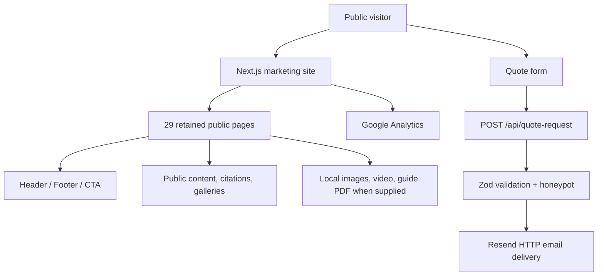

# Production Cleanup Removal Plan

**Date:** 2026-07-16  
**Status:** Approved by the owner on 2026-07-17  
**Execution state:** Completed and deployed to production on 2026-07-17.

## Strategy summary

- **Recommended path:** Decouple quote email from CRM first, remove the authenticated/operations stack as one bounded change, then prune legacy public code/assets and repair the retained marketing information architecture.
- **Why:** The quote endpoint is the only retained feature that reaches admin/Supabase code. Breaking that single edge makes the remaining feature deletions mechanically safe and prevents a partially removed contact path.
- **Tradeoff:** The cleanup is a large deletion even though the replacement work is small. It should be executed in ordered checkpoints with a build and focused tests between the dependency-breaking step and destructive deletions.
- **Minimal fallback:** Remove routes and packages but retain historical docs/assets. This is not recommended because it misses the stated production-readiness and repository-size goals.
- **Best-in-class version:** Complete the default cleanup, wire all retained public pages, ship the owner-provided Homeowner Guide PDF, leave a focused marketing-only test suite, deploy the verified application, and complete production smoke testing.

## Approval assumptions

The owner approved Phase 4 with the decisions recorded below.

| Decision | Proposed default | Why |
|---|---|---|
| Admin, CRM, portals, auth, Supabase, internal operations | **REMOVE** | Explicit project direction. |
| `/estimate`, `/project-timelines`, `/demo-slider` | **REMOVE** | Unlinked, not in final scope, and contain unverified/demo behavior. |
| `/blog` | **KEEP as a curated landing page** | The retained cards now lead to complete education and project destinations. Dedicated article routes remain outside the finished scope until full articles are ready. |
| `/flipbook` | **KEEP** | It is a public project lookbook in the current primary navigation. It is not the Homeowner Guide. |
| Detailed project pages and `/service-areas` | **KEEP and link into UI** | Strong marketing/SEO content that is currently direct-URL-only. |
| Homeowner Guide code | **KEEP** | Required education feature. |
| Homeowner Guide PDF | **ADD supplied owner file** | The owner supplied `/Users/ansoncordeiro/Downloads/Kiefer Built Homeowner Guide.pdf`. |
| Source/runtime audit reports | **KEEP through old-site comparison** | They are required comparison inputs. |
| 345 untracked runtime screenshots | **Do not commit; retain locally through the old-site comparison** | Approximately 118 MiB and explicitly retained by the owner. |
| Hosted Supabase project | **NO ACTION** | External deletion/decommissioning is outside repository cleanup and requires separate authority. |

## Target architecture



There is no database, authentication layer, dynamic route, admin shell, client portal, vendor portal, or demo mode in the target.

### Retained route allow-list

The target contains these 29 public pages:

```text
/
/about
/about/team
/about/accolades
/blog
/careers
/contact
/flipbook
/process
/products
/projects
/projects/commercial
/projects/contemporary-ranch
/projects/mountain-modern
/projects/new-builds
/projects/renovations-additions
/service-areas
/services
/services/home-building
/services/custom-elevators
/testimonials
/vendors
/why-kiefer-built
/why-kiefer-built/sips
/why-kiefer-built/energy-efficiency
/why-kiefer-built/indoor-air-quality
/why-kiefer-built/built-for-colorado
/why-kiefer-built/quality
/why-kiefer-built/cost-of-ownership
```

Retained server endpoint and static resources:

```text
POST /api/quote-request
/robots.txt
/sitemap.xml
/guides/kiefer-built-homeowner-guide.pdf
```

## Feature removal matrix

| Feature | Files | Routes | Components | Utilities | Database | Tests | Images / styles | Environment / configuration | Estimated impact | Risk | Replacement required? |
|---|---|---|---|---|---|---|---|---|---|---|---|
| Quote-to-CRM coupling | Modify `src/app/api/quote-request/route.ts`, `src/lib/contact/{process-quote-request,quote-request}.ts`, tests, `Contact.tsx` | Keep `/api/quote-request` | Keep Contact | Remove `createLead`, `LeadCreateInput`, lead mapping, `leadId` response | Releases `leads` and public-insert migration | Rewrite 2 contact tests | None | Keep only Resend/contact variables | Releases 30 transitive operations/DB files from public closure | Medium; conversion path | **Yes:** email-only processing with same validation/honeypot/errors |
| Admin dashboard and CRM | `src/app/admin/**`, `src/components/admin/**`, `src/lib/admin/**` | 49 admin route entries | 16 admin components | Queries, types, formatters, demo records, finance/report logic, PDF builders | All admin tables/policies/storage | 32 admin-lib tests + admin component test | Remove internal PDF collateral separately; public logo remains | Remove admin/demo config | 159 source files including tests/actions; major source reduction | Low after quote decoupling | No |
| Land Lead Finder | `src/app/admin/land-leads/**`, `src/lib/land-leads/**` (included in admin route deletion plus 24 library files) | `/admin/land-leads`, detail, export | 2 land lead controls (included above) | CSV parse/normalize/hash/score/filter/query/export | `land_leads` migration | 10 tests | None | Remove 30 MiB Server Action limit, PapaParse packages | Removes an isolated feature and its only special Next config | Low | No |
| Client portal | `src/app/portal/**`, client auth/portal modules (admin lib deletion) | 3 page routes, 1 dynamic template | Remove portal-only update notification via shell cleanup | Approval actions, owner view builders | Client auth/RLS migrations | Client auth/portal tests | None | Remove app URL/Supabase auth | Removes owner dashboard and dynamic project route | Low; public copy cleanup required | Replace “portal” language with general communication language only |
| Authenticated vendor portal | `src/app/vendor/**`, vendor auth/portal/submittal modules | `/vendor`, `/vendor/login` | Portal uses admin StatusBadge | Vendor responses/submittals/storage | Vendor tables/policies/storage | Vendor auth/portal/RFI/submittal tests | None | Remove auth vars | Removes singular portal while retaining plural public `/vendors` | Medium naming-confusion risk | Public `/vendors` mailto page remains |
| Authentication/authorization | `src/app/login/**`, `src/app/auth/callback/route.ts`, `src/proxy.ts`, Supabase auth helpers | `/login`, `/auth/callback`; proxy matcher | PasswordField | Session/role/redirect helpers | Profiles/Auth policies | Login/auth tests | None | Remove Supabase/demo/admin/app URL variables | Removes all protected and demo access behavior | Low after consumers removed | No |
| Operations PDFs/finance | Included in admin deletion | Proposal/invoice/change-order/finance download handlers | Download buttons and finance calculators | React PDF documents and finance exports | Finance/proposal/invoice tables | Related admin tests | Remove tracked Platform Tour and branded invoice collateral | Remove `@react-pdf/renderer` | Releases PDF package and internal sales collateral | Low | Static Homeowner Guide is separate and retained |
| Supabase infrastructure | `src/lib/supabase/**`, `supabase/**`, `.mcp.json`, `.agents/**`, `skills-lock.json` | None after route deletion | None | Server/browser clients, env parsing, generated DB types | 23 migrations, seed, config, buckets/policies | Supabase env test | None | Remove Supabase variables and tooling | Removes all database/auth/storage source and setup burden | Medium ordering risk | Email-only quote path must pass first |
| Demo/developer utilities | `/demo-slider`, `/estimate`, `/project-timelines`; 20 legacy/demo components; slider type/docs | 3 pages | Legacy and demo component list from analysis | Hard-coded calculators/timelines/notifications | None | Floating-action/slider-adjacent tests as applicable | Remove frame sequences and other orphan assets | Remove obsolete `next.config.ts` option | 26+ source files and misleading direct URLs | Low | `/process`, `/projects`, and quote form cover legitimate journeys |
| Design-sync tooling | `.design-sync/**`; ignored `.ds-sync/**`, `ds-bundle/**` | None | Preview maps reference many deleted components | Bundle/capture/preview shims | None | Tool-specific caches only | Generated screenshots/bundles | Remove ignore rules/tool config | Removes local lint failures and ~50 MiB ignored tooling | Low unless design-sync is still desired | No for the production runtime |
| Unused static assets | 355 files listed in analysis | None | References only removed/unreachable code or none | None | None | Asset existence tests must still pass | ~90.46 MiB removed; retain 64 active media files | None | Largest tracked-size reduction | Medium; validate every retained path | Git history is recovery path |
| Operations/historical documentation | CRM docs, Buildertrend comparison, platform tour/screenshots/email, operations plans/specs, stale tasks | None | None | None | None | None | ~11.4 MiB operations collateral plus docs | Rewrite README/AGENTS/deployment docs | Removes contradictory project documentation | Low | `cleanup-summary.md` becomes the production completion summary |
| Unused packages | Supabase packages, React PDF, PapaParse/types, clsx, Playwright by default | None | None | Package graph | None | Retained Vitest suite remains | None | Update package/lock together | Smaller install and attack surface | Medium if removed before imports | No; browser validation can use external automation |

## Ordered Phase 4 execution plan

### 0. Establish the approved work boundary

1. Record fresh `git status --short --branch` and preserve all pre-existing audit files.
2. Create the implementation-mode `tasks.todo.md` required by `AGENTS.md`, replacing the completed Land Lead task with this cleanup checklist.
3. Record baseline tracked bytes/file count/source lines and retained-route allow-list.
4. Record the owner's Blog and audit-screenshot decisions.
5. Do not call linked Supabase commands and do not alter Vercel or production during repository cleanup.

**Checkpoint:** Only planning/task documentation changes.

### 1. Make quote delivery independent of CRM

Modify only:

- `src/app/api/quote-request/route.ts`
- `src/lib/contact/process-quote-request.ts`
- `src/lib/contact/process-quote-request.test.ts`
- `src/lib/contact/quote-request.ts`
- `src/lib/contact/quote-request.test.ts`
- `src/components/Contact.tsx`

Required behavior:

- Keep JSON parsing, Zod validation, field issues, honeypot silent success, Resend request, reply-to, configured/unconfigured behavior, 502 handling, and mailto fallback.
- Delete the `createLead` dependency and best-effort CRM block.
- Delete lead-domain imports and `buildQuoteRequestLeadInput`.
- Do not return `leadId`.
- Change visitor success text from “saved” to “sent.”
- Test configured success, missing email configuration, failed email delivery, thrown email delivery, and honeypot behavior without a CRM mock.

**Checkpoint:** Run focused contact tests, typecheck, and build before any operations file is deleted. Re-run the static import closure and prove no retained route imports `src/lib/admin`, `src/lib/supabase`, or `src/lib/land-leads`.

### 2. Remove operations behavior from the public shell and copy

1. Simplify `GlobalFloatingAction` to render only the quote CTA on retained routes.
2. Change `FloatingCTA` destination to `/#contact`.
3. Delete `ProjectUpdateNotification.tsx` and `src/lib/floating-actions{,.test}.ts` after the wrapper no longer imports them.
4. Remove BuilderTrend preconnect/dns-prefetch and portal-specific FAQ JSON-LD from `src/app/layout.tsx`.
5. Replace `publicPages.process` “client portal”/“Portal Communication” wording with neutral, true communication language; do not invent a replacement platform.
6. Search retained source for `/admin`, `/portal`, `/vendor` (singular), `/login`, `/auth`, `Supabase`, `CRM`, `BuilderTrend`, and demo language.

**Checkpoint:** Public route tests and typecheck pass with the old operations tree still present but no longer reachable from retained code.

### 3. Delete entire route surfaces

Delete as complete units:

```text
src/app/admin/**
src/app/login/**
src/app/portal/**
src/app/vendor/**
src/app/auth/**
src/proxy.ts
```

Also delete:

```text
src/app/demo-slider/page.tsx
src/app/estimate/page.tsx
src/app/project-timelines/page.tsx
```

Retain `src/app/blog/page.tsx`, its navigation item, and `publicPages.blog`. Keep the incomplete-card status explicit in project documentation.

No redirects are proposed for removed private/internal routes. They should cease to exist and return the normal not-found response. Public content routes are preserved rather than redirected.

**Checkpoint:** Build route output contains no admin/auth/portal/vendor/demo/estimate/timeline routes and no dynamic route templates.

### 4. Delete operations libraries, components, tests, and database code

Delete as complete units:

```text
src/components/admin/**
src/lib/admin/**
src/lib/land-leads/**
src/lib/supabase/**
src/types/slider.ts
supabase/**
```

Then delete the 20 legacy/demo public components identified in `cleanup-analysis.md`, including the three before/after components and the now-unused portal notification.

**Checkpoint:** Static import scan reports only retained marketing/contact source. `rg` reports no imports from the deleted directories.

### 5. Remove residual dependencies, automation, and configuration

Remove from `package.json` and regenerate `package-lock.json`:

```text
@react-pdf/renderer
@supabase/ssr
@supabase/supabase-js
papaparse
@types/papaparse
clsx
playwright  # unless real checked-in smoke tests are added instead
```

Remove, rewrite, or explicitly validate:

```text
next.config.ts                       # only Land Lead 30 MiB Server Action option
src/proxy.ts / middleware files      # no private-route interception remains
.mcp.json                            # Supabase project connector
.agents/**
skills-lock.json
.env.example                         # retain only Resend/contact variables
.gitignore                           # prune obsolete tool/schema/archive entries carefully
package.json scripts                 # retain only commands backed by current files and tooling
root scripts/utilities               # remove CRM/demo/database/build helpers no longer used
.github/workflows/**                 # remove or rewrite jobs, secrets, paths, and commands for deleted systems
vercel.json / hosting configuration  # if present, retain only current public-site runtime needs
TypeScript/ESLint/Vitest/PostCSS config # remove aliases, paths, ignores, and options for deleted code
```

Regenerate `package-lock.json` through npm after editing `package.json`; do not manually edit the lockfile. Validate the result with a clean install, `npm ls --depth=0`, and a prune/extraneous-package check as appropriate.

Inspect `.github` even if it is empty and record that no repository workflow remains to build, test, deploy, or reference a deleted system. Verify the deployment provider's framework preset, root directory, install command, build command, output settings, Node runtime, environment-variable inventory, and Git integration during the deployment phase. Remove obsolete hosted variables and build overrides only after the cleaned deployment proves they are unused.

**Checkpoint:** Every retained package, npm script, environment variable, middleware file, workflow, and build/deployment setting has a current public-site purpose. No item exists solely for CRM, admin, portals, authentication, Supabase, operations, or demos.

### 6. Prune unused assets and legacy tooling

Delete the 355 media files enumerated in the analysis:

- All 145 `earth-frames` images.
- All 180 `explode-frames` images.
- `kieferearthlogo.mp4`.
- 16 unused Project 1 photos.
- 12 unused Project 4 photos.
- Alternate `team/miles-kiefer.jpg`.

Delete unused starter SVGs and slider documentation. Delete tracked `.design-sync/**` and local ignored `.ds-sync/**`/`ds-bundle/**` if design-sync removal is approved. Delete ignored local archive copies (`public.zip`, `src.zip`, `supabase.zip`) after confirming Git contains the source versions.

Retain exactly the active 64 marketing media files identified in the analysis, plus icons, sitemap, robots, and the guide PDF when supplied.

**Checkpoint:** Every `/images/...` reference resolves; every retained media file has a source reference or documented static purpose.

### 7. Complete the retained public information architecture

1. Add discoverable links to `/projects/contemporary-ranch` and `/projects/mountain-modern` from the project hub or New Builds page.
2. Add a discoverable link to `/service-areas` from the homepage service-area section, Header, or Footer. Prefer one clear location over duplicating it everywhere.
3. Keep `/vendors` reachable from Products and confirm its mailto-only behavior.
4. Remove Blog navigation if Blog is removed.
5. Rebuild `sitemap.xml` from the retained route allow-list, or replace it with a typed `src/app/sitemap.ts`; use only one source of truth.
6. Ensure removed routes are not present in sitemap, navigation, structured data, or tests.
7. Audit per-page titles/descriptions/canonicals so pages do not inherit the home canonical.
8. Remove the malformed `tel:(970)515-5059` value on `/service-areas` while touching that retained page.
9. Keep the Homeowner Guide band conditional. If the owner supplies the PDF, place it at the exact configured path and verify size/download behavior.

**Checkpoint:** Navigation/link graph has no orphaned retained pages and no unresolved internal destination.

### 8. Replace stale documentation and remove internal collateral

Rewrite:

- `README.md` as a marketing-only setup/deployment guide.
- `AGENTS.md` product/runtime/source-of-truth sections for the final architecture.
- `docs/deployment-production-checklist.md` for public routes, quote email, analytics, SEO, images, and responsive/browser checks.

Remove:

- CRM/Buildertrend inventory and comparison documents.
- Operations platform tour, screenshots, follow-up email, plans, and specs.
- Completed Land Lead task documentation.
- Obsolete slider guides.

Retain the two cleanup documents and later create `docs/cleanup-summary.md`. Retain source/runtime audit reports until the live-site comparison is complete. Consolidate or selectively remove `.sessions` entries as part of project completion.

**Checkpoint:** A text search for operations-product language finds only historical notes intentionally retained for the comparison.

### 9. Final dependency and dead-code pass

1. Re-run the static import graph from every retained route.
2. Identify any source file not reachable from a route or retained test; remove it or document why it is a deliberate standalone tool.
3. Compare package imports to direct dependencies.
4. Compare literal/dynamic static asset paths to `public` files.
5. Verify CSS has no feature-specific selectors left for removed components.
6. Verify root docs/config do not name removed env variables, routes, packages, migrations, or commands.
7. Verify every npm script resolves to an installed tool and an existing file or supported framework command.
8. Verify `.github` workflows and repository automation contain no stale paths, secrets, service setup, or deployment assumptions.
9. Verify the documented and hosted environment-variable allow-list contains only variables used by retained runtime code.
10. Verify the production build emits no Proxy/Middleware entry and uses no configuration override inherited from a removed feature.

**Checkpoint:** No orphaned source, unused direct package, stale lockfile-only package, obsolete environment variable, dead script, stale workflow, unnecessary middleware, removed-feature configuration, stale route string, or unresolved asset remains.

## Validation plan

### Automated checks

Run from a clean dependency install where practical:

```bash
npm run typecheck
npm run lint
npm test
npm run build
```

Expected build route rules:

- Exactly the retained public allow-list, optional Blog decision, quote API, and framework not-found route.
- No `/admin`, `/login`, `/auth`, `/portal`, singular `/vendor`, `/demo-slider`, `/estimate`, or `/project-timelines` route.
- No dynamic route (`[...]`) in final application output.
- No Proxy/Middleware entry.

Required focused assertions:

- Quote validation/honeypot/email success and failure paths.
- Public navigation contains only existing retained routes.
- Education citation integrity still passes.
- Renovation image references still exist.
- Homeowner Guide path remains guarded when absent and downloads when supplied.
- Package tree contains no removed direct dependencies.
- A clean install contains no extraneous packages and every npm script invokes only retained tooling.
- Repository and hosted environment-variable inventories contain no deleted-system variables.
- Repository automation, GitHub workflows, and build/deployment settings contain no deleted-system paths, commands, secrets, or overrides.

### Static repository checks

Search retained files for:

```text
/admin
/portal
/vendor        (allow only plural /vendors and external/vendor prose where intentional)
/login
/auth/callback
Supabase
NEXT_PUBLIC_DEMO_MODE
NEXT_PUBLIC_SUPABASE
ADMIN_EMAIL
NEXT_PUBLIC_APP_URL
BuilderTrend
createLead
LeadCreateInput
@react-pdf/renderer
papaparse
```

Any result must be either removed or explicitly justified in the final summary.

### Browser checks

On desktop and mobile widths:

1. Visit all retained public routes without relying only on the header.
2. Open every desktop dropdown and mobile section.
3. Follow every internal header, footer, card, CTA, related-content, and project link.
4. Verify Home, Contact, vendor mailto preparation, education citations, galleries/lightboxes, renovations controls, Mountain Modern video, and floating quote CTA.
5. Check console errors, 404s, broken images, layout shifts, focus behavior, and keyboard navigation.
6. Do not submit fake production forms. Exercise quote delivery through unit/integration mocks or an explicitly approved non-production recipient.

### Deployment/environment checks

- Production retains `RESEND_API_KEY`, `CONTACT_EMAIL_FROM`, and `CONTACT_EMAIL_TO`.
- Obsolete Supabase/demo/admin/app URL variables are removed from deployment settings only after the cleaned deployment succeeds.
- Hosting settings match the actual application: correct repository/root directory, framework preset, install command, build command, output behavior, and supported Node runtime.
- Git-connected deployment settings and any GitHub Actions contain no deleted-system jobs, paths, service setup, secrets, or environment assumptions.
- Analytics ID is confirmed as owner-controlled.
- The hosted Supabase project remains untouched unless separately authorized.

## Risk controls

| Risk | Control |
|---|---|
| Quote form breaks when admin queries disappear | Decouple and verify first; delete operations code only after closure scan is clean. |
| Public `/vendors` is confused with singular portal `/vendor` | Keep plural route/component in explicit allow-list and assert it in navigation/link tests. |
| Valuable photos are deleted accidentally | Generate retained reference manifest, verify all paths, rely on Git history for recovery. |
| Homeowner Guide is claimed complete without a file | Keep existence guard and list owner-supplied PDF as an unresolved acceptance item. |
| Lint remains noisy from generated tooling | Remove design-sync output or explicitly exclude generated paths if tooling is retained. |
| Old private routes remain deployed through overlooked files | Compare build route output against allow-list and require zero dynamic routes. |
| Remote database is accidentally changed | No linked Supabase command in this project; repository-only deletion. |
| Dirty audit work is overwritten | Record status before each phase and never reset/revert unrelated files. |

## Final cleanup summary requirements

After approved implementation and validation, create `docs/cleanup-summary.md` containing:

- Features removed.
- Exact files and routes removed.
- Packages, lockfile residue, environment-variable references, middleware, scripts, workflows, and obsolete build/deployment settings removed.
- Lines of source removed, measured from the recorded baseline.
- Tracked logical repository size before and after; report `.git`, generated caches, and untracked audit screenshots separately.
- Final public route allow-list.
- Remaining components, libraries, tests, and direct dependencies.
- Verification commands and results.
- Browser route/link/asset findings.
- Homeowner Guide PDF status.
- Blog decision.
- Audit-artifact retention decision.
- Hosted Supabase status (expected: untouched unless separately authorized).
- Production deployment status and follow-up recommendations.

## Approval boundary

Approval of this plan authorizes repository changes in the ordered Phase 4 scope only. It does not authorize:

- Dropping or altering the hosted Supabase project.
- Removing production environment variables before a cleaned deployment is verified.
- Submitting public forms with fake data.
- Committing, pushing, merging, or deploying.
- Deleting the audit screenshot corpus unless that retention decision is explicitly included.

Phase 4 was approved on 2026-07-17. Blog retention, local screenshot retention, and the supplied Homeowner Guide PDF are locked implementation decisions.
