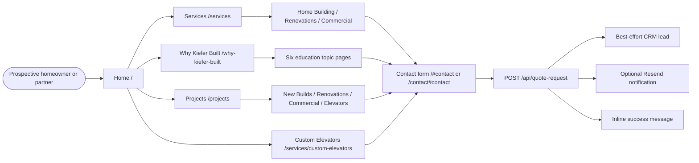

# Redesign Source Architecture and Content Audit

Audit date: 2026-07-15  
Scope: repository source only; no live-site crawl, runtime session, deployed environment, or database inspection.  
Companion inventory: [`docs/redesign-page-inventory.csv`](./redesign-page-inventory.csv)

## 1. Executive Summary

The redesigned application is a Next.js 16 App Router project that combines three materially different products in one route tree:

1. Thirty-two public-facing non-auth page endpoints spanning marketing, education, planning tools, project pages, and one developer demo.
2. Three authenticated non-admin application pages for clients and vendors, plus three public login pages and a shared auth callback.
3. A 49-endpoint admin operations platform (43 pages and 6 download/export handlers) backed by Supabase when configured and demo records otherwise.

The source contains **89 route endpoints total: 81 pages and 8 request handlers**. Twenty-six endpoints are dynamic. Twenty-four public pages appear in the primary header navigation, the homepage is reachable through the logo, and `/vendors` is reached from the Products page. The shared footer contains **no internal navigation links**.

The redesigned public messaging is strongest on the homepage and the seven-page “Why Kiefer Built” education cluster. It consistently emphasizes family accountability, craftsmanship, communication, energy performance, Colorado resilience, indoor air quality, transparent tradeoffs, and long-term ownership value. The education pages use a 13-source registry and visibly distinguish independent sources from SIP-industry data.

The most important source-level concerns for comparison and pre-publication review are:

- Six public pages are direct-URL-only: `/demo-slider`, `/estimate`, `/project-timelines`, `/projects/contemporary-ranch`, `/projects/mountain-modern`, and `/service-areas`. The admin Land Lead Finder hub is also navigation-hidden, bringing the top-level direct-only count to seven.
- The global floating “Get a Free Quote” link targets local `#contact`. That anchor exists only on `/` and `/contact`, so the control has an unresolved destination on the other 30 public pages.
- `public/sitemap.xml` lists only the homepage, while `public/robots.txt` allows all routes. Admin pages have `noindex`, but the login, client portal, vendor portal, planning tools, project detail pages, and developer demo inherit index/follow metadata unless runtime or platform behavior overrides it.
- The root canonical is the homepage. Only `/projects/mountain-modern` defines its own canonical, so most child routes inherit a homepage canonical in source.
- The globally injected FAQ schema describes a four-step process with 3D renderings and a BuilderTrend portal; the visible `/process` page describes five steps and a generic Kiefer Built portal. The schema is injected on every route, including auth and application routes.
- The 19-page homeowner-guide download path appears in content but its PDF is absent. The component checks file existence and therefore suppresses the download band rather than rendering a broken link.
- The Journal looks like an article listing, but none of its four cards link anywhere and no article-detail routes exist.
- The public Project Gallery does not link either detailed project page. Both detailed pages send “View More Projects” or “Back to Portfolio” to `/`, not `/projects`.
- `/demo-slider` is explicitly a developer demonstration exposed as a public route. It presents same-project finished images as before/after transformations and displays a path to a missing guide document.
- `/estimate` and `/project-timelines` publish hard-coded price/timeline assumptions. The timeline page also publishes an “Our Guarantee” list. These need current owner and, where appropriate, legal review before customer use.
- The client portal globally overlays hard-coded “Modern Farmhouse” and “Kitchen Remodel” updates, a “Photo would display here” placeholder, and a subscription button without an action. These are not derived from the signed-in client’s data.
- In demo mode, admin auth is intentionally bypassed. Three PDF handlers and the land-lead CSV export rely on the `/admin` proxy rather than performing an explicit handler-level admin check, so those endpoints are also reachable without a real admin session when demo mode is enabled.

No source file establishes what content was approved on the older live website. That comparison needs a separate crawl, legacy copy export, owner notes, and evidence for operational/quantitative claims.

## 2. Repository and Framework Overview

### Stack and routing convention

| Area | Source-derived finding |
|---|---|
| Framework | Next.js 16.2.6 with the App Router under `src/app`. |
| UI runtime | React 19.2.3 and TypeScript strict mode. |
| Styling | Tailwind CSS 4 plus global CSS/theme variables. |
| Package manager | npm with `package-lock.json`. |
| Rendering | Mixed server/client components; this is not a static-export application. |
| Backend | Supabase Auth, Postgres, Storage, SSR clients, and RLS migrations. |
| Forms/actions | Next.js Server Actions for admin/client/vendor mutations; public quote form posts JSON to a Route Handler. |
| Email | Direct call to the Resend HTTP API from `/api/quote-request`. |
| Documents | `@react-pdf/renderer` for invoices, proposals, and change orders; text and CSV exports for finance and land leads. |
| Validation | Zod for environment values and quote/request inputs; domain parsers for other forms. |
| Tests/tooling | Vitest, ESLint 9, TypeScript, Playwright, and Vercel deployment documentation. |

There are no App Router route groups. Three layouts were found:

- `src/app/layout.tsx`: root metadata, JSON-LD, global fonts, Google Analytics, and the route-sensitive floating action.
- `src/app/admin/layout.tsx`: admin authorization plus `noindex, nofollow` metadata.
- `src/app/projects/mountain-modern/layout.tsx`: project-specific metadata, canonical, Open Graph/Twitter data, and JSON-LD.

There are no route-level `loading.tsx`, `error.tsx`, `not-found.tsx`, or `template.tsx` files. Dynamic pages call `notFound()` where records do not resolve, so they fall through to framework default not-found handling.

### Public rendering model

Most public pages are thin route wrappers around:

- `src/lib/public-site/content.ts`: titles, descriptions, CTAs, proof points, cards, sections, testimonials, comparisons, and guide-download declarations.
- `src/components/public-site/PublicPage.tsx`: shared hero → intro → cards → split sections → testimonials → optional guide → citations → closing CTA renderer.
- `src/lib/public-site/sources.ts`: 13 education citations; sources 3–5 are flagged as industry data and all others as independent.

No headless CMS, CMS SDK, or external marketing-content API was found. Public marketing copy is committed in TypeScript page/component/data files; Supabase is used for operations and portal records rather than public-page authoring.

Custom public renderers exist for the homepage, contact form, renovations showcase, custom elevators, flipbook, vendor interest, service areas, estimate planner, project timelines, two project detail pages, and the slider demo.

### Data and environment behavior

The source reads these environment values:

| Variable | Source use |
|---|---|
| `NEXT_PUBLIC_SUPABASE_URL` | Supabase server/browser client configuration. |
| `NEXT_PUBLIC_SUPABASE_ANON_KEY` | Supabase public client key. |
| `NEXT_PUBLIC_DEMO_MODE` | Demo mode is on unless the value is exactly `false`. |
| `NEXT_PUBLIC_APP_URL` | Builds login and auth-callback URLs; defaults to `http://localhost:3000`. |
| `ADMIN_EMAIL` | Optional admin allow-list and vendor RFI contact fallback. |
| `RESEND_API_KEY` | Enables contact email delivery. |
| `CONTACT_EMAIL_FROM` | Required sender for contact email delivery. |
| `CONTACT_EMAIL_TO` | Recipient; defaults to `info@kbuiltco.com`. |

`src/lib/admin/queries.ts` returns demo records when demo mode is enabled, Supabase values are missing, or some reads fail. Most demo mutations return “not persisted” errors. Client auth has a demo client fallback. Vendor auth does not have an equivalent demo session fallback.

The Supabase migrations define profiles, clients, leads, projects, phases, updates, files, workers, time entries, invoices, proposals, change orders, comments, daily logs, selections, RFIs, purchasing, photos, vendors, vendor assignments, vendor responses/submittals, finance snapshots/targets, warranty, land leads, storage buckets, and RLS policies. Source review can confirm those definitions exist; it cannot confirm that any deployed database has applied them.

### Global metadata and indexing

The root layout declares:

- Title: “Built by Kiefer | Custom Home Builder in Windsor & Northern Colorado.”
- Description: custom homes, renovations, commercial spaces, 25+ years, Windsor/Northern Colorado, and phone number.
- Canonical: `https://www.builtbykiefer.com`.
- LocalBusiness, WebSite, and FAQ JSON-LD.
- `index: true`, `follow: true`.
- Google Analytics ID `G-BBCR31BJSM`.

Because this metadata and schema live in the root layout, they apply broadly unless a child overrides them. Source-specific overrides exist for the seven “Why Kiefer Built” routes, custom elevators, renovations/additions, and mountain-modern; only mountain-modern overrides the canonical. Admin layout disables indexing for `/admin/**`. No equivalent source metadata was found for login, portal, vendor, demo, estimate, timelines, service areas, or most general public pages.

## 3. Global Navigation Structure

### Public header

The public header logo links to `/`. Desktop category labels with children are buttons, not direct links; their dropdowns include an overview/first child that reaches the category route. Mobile category labels do link to the category route and then repeat it in the child list.

| Category | Parent | Children |
|---|---|---|
| About | `/about` | `/about`, `/about/team`, `/about/accolades`, `/blog` |
| Why Kiefer Built | `/why-kiefer-built` | `/why-kiefer-built`, `/why-kiefer-built/sips`, `/why-kiefer-built/energy-efficiency`, `/why-kiefer-built/indoor-air-quality`, `/why-kiefer-built/built-for-colorado`, `/why-kiefer-built/quality`, `/why-kiefer-built/cost-of-ownership` |
| Service | `/services` | `/services`, `/products`, `/process`, `/services/home-building`, `/services/custom-elevators`, external `https://epsbuildings.com/` |
| Our Work | `/projects` | `/projects`, `/flipbook`, `/projects/new-builds`, `/projects/commercial`, `/projects/renovations-additions`, `/testimonials` |
| Careers | `/careers` | None |
| Contact Us | `/contact` | `/contact` |

There are 24 unique internal header destinations. Header anchor resolution prefixes `/` when a `#...` link is used from a non-home route.

### Public footer

The shared footer has no internal sitemap or page navigation. It links only to:

- EPS Buildings: `https://epsbuildings.com`
- Facebook: `https://www.facebook.com/KieferBuiltContracting`
- Instagram: `https://www.instagram.com/kieferbuiltco`
- `https://kbuiltco.com`
- Nexgen Studio: `https://nexgenstudio.io`

The root LocalBusiness JSON-LD uses `https://www.instagram.com/kieferbuiltcontracting`, which differs from the footer/project-page Instagram URL.

### Global floating action

| Path condition | Rendered control | Destination/data |
|---|---|---|
| `/login`, `/admin/**`, `/vendor/**` | None | None |
| `/portal/**` | Project Updates bell | Hard-coded sample updates in `ProjectUpdateNotification.tsx` |
| All other paths | “Get a Free Quote” | Local `#contact` anchor |

The quote control is valid on `/` and `/contact`. The other 30 public pages do not define `id="contact"`, so the globally rendered destination is unresolved there.

### Admin navigation

`src/lib/admin/navigation.ts` groups live and disabled entries under Sales, Jobs, Project Management, Files, Messaging, Financial, and Reports. Several labels alias the same destination:

- Lead Opportunities, Lead Activities, and Lead Activity Calendar → `/admin/leads`
- Summary, Client Updates, Command Center → `/admin`
- Job Info, Jobs List, New Job From Scratch, Plans and Specs, Documents → `/admin/projects`
- Bids and Lead Proposals → `/admin/proposals`
- Job Costing Budget, Job Reports, and Financial Reports → `/admin/reports`

Disabled labels have no href: Lead Map, Jobs Map, New Job From Template, Videos, Messages, Notification History, Surveys, Estimate (Internal), Cost Inbox, and Online Payment Report.

The admin header additionally links its logo to `/admin`, its plus icon to `/admin/projects`, and sign-out to `/login`. The search field and notification button have no wired action. `/admin/land-leads` is absent from navigation.

### Authenticated navigation

- Client dashboard links each visible project to `/portal/projects/[projectId]`; sign-out redirects to `/portal/login`.
- Client project detail has no visible link back to `/portal` in its source.
- Vendor workboard links to `/`, submits actions back to `/vendor`, and signs out to `/vendor/login?next=%2Fvendor`.
- All three login pages participate in `/auth/callback` magic-link flow. Client and vendor login logos link home; admin demo login links directly to `/admin`.

## 4. Complete Route Inventory

The table below is the condensed route register. The companion CSV contains the full requested per-route fields: audience, parent section, primary-nav/footer presence, auth requirement, incoming/outgoing links, status, copy summary, themes, likely legacy match, and issues.

Route-type counts overlap where appropriate: the six admin handlers are both admin routes and API/handler routes.

| Route | Type | Source | Primary heading / purpose | Reachability and status |
|---|---|---|---|---|
| `/` | Public page | `src/app/page.tsx` | Custom Homes Built With Precision in Northern Colorado | Logo/home entry; complete; claims need verification |
| `/about` | Public page | `src/app/about/page.tsx` | Relentless Pursuit of Perfection | Header; complete |
| `/about/accolades` | Public page | `src/app/about/accolades/page.tsx` | Awards, Press, and Performance Recognition | Header; claims/links need verification |
| `/about/team` | Public page | `src/app/about/team/page.tsx` | The Kiefer Built Team | Header; roles need verification |
| `/admin` | Admin page | `src/app/admin/page.tsx` | Command Center | Protected in production; demo fallback |
| `/admin/bills` | Admin page | `src/app/admin/bills/page.tsx` | Bills | Admin nav; demo fallback |
| `/admin/change-orders` | Admin page | `src/app/admin/change-orders/page.tsx` | Change Orders | Admin nav; demo fallback |
| `/admin/change-orders/[changeOrderId]` | Admin dynamic page | `src/app/admin/change-orders/[changeOrderId]/page.tsx` | Dynamic change-order title | From list/project; 404 on unknown ID |
| `/admin/change-orders/[changeOrderId]/download` | Admin dynamic handler | `src/app/admin/change-orders/[changeOrderId]/download/route.tsx` | Change-order PDF | Proxy-auth dependent; PDF/404 |
| `/admin/comments` | Admin page | `src/app/admin/comments/page.tsx` | Comments | Admin nav; demo fallback |
| `/admin/daily-logs` | Admin page | `src/app/admin/daily-logs/page.tsx` | Daily Logs | Admin nav; demo fallback |
| `/admin/finance-snapshots/[snapshotId]/download` | Admin dynamic handler | `src/app/admin/finance-snapshots/[snapshotId]/download/route.ts` | Finance text export | Explicit admin check; 401/404 possible |
| `/admin/finance-tools` | Admin page | `src/app/admin/finance-tools/page.tsx` | Kiefer Built Finance Tools | Admin nav; calculators and snapshots |
| `/admin/invoices` | Admin page | `src/app/admin/invoices/page.tsx` | Invoices | Admin nav; demo fallback |
| `/admin/invoices/[invoiceId]/download` | Admin dynamic handler | `src/app/admin/invoices/[invoiceId]/download/route.tsx` | Invoice PDF | Proxy-auth dependent; PDF/404 |
| `/admin/land-leads` | Admin page | `src/app/admin/land-leads/page.tsx` | Land Lead Finder | Direct URL only; demo writes disabled |
| `/admin/land-leads/[landLeadId]` | Admin dynamic page | `src/app/admin/land-leads/[landLeadId]/page.tsx` | Dynamic Land Lead Record | From hidden hub; 404 on unknown ID |
| `/admin/land-leads/export` | Admin handler | `src/app/admin/land-leads/export/route.ts` | Filtered mailing CSV | From hidden hub; proxy-auth dependent |
| `/admin/leads` | Admin page | `src/app/admin/leads/page.tsx` | Lead + Client CRM | Admin nav; multiple label aliases |
| `/admin/leads/[leadId]` | Admin dynamic page | `src/app/admin/leads/[leadId]/page.tsx` | Dynamic Lead Record | From CRM/dashboard/schedule; 404 possible |
| `/admin/leads/[leadId]/proposals/new` | Admin dynamic page | `src/app/admin/leads/[leadId]/proposals/new/page.tsx` | Proposal for [lead] | From lead detail; form |
| `/admin/leads/new` | Admin page | `src/app/admin/leads/new/page.tsx` | New Lead | From lead list; form |
| `/admin/photos` | Admin page | `src/app/admin/photos/page.tsx` | Project Photos | Admin nav; demo fallback |
| `/admin/projects` | Admin page | `src/app/admin/projects/page.tsx` | Jobs | Admin nav; no project-create route |
| `/admin/projects/[projectId]` | Admin dynamic page | `src/app/admin/projects/[projectId]/page.tsx` | Dynamic project name | Central project hub; 404 possible |
| `/admin/projects/[projectId]/bills/new` | Admin dynamic page | `src/app/admin/projects/[projectId]/bills/new/page.tsx` | Bill for [project] | Project-scoped form |
| `/admin/projects/[projectId]/change-orders/new` | Admin dynamic page | `src/app/admin/projects/[projectId]/change-orders/new/page.tsx` | Change Order for [project] | Project-scoped form |
| `/admin/projects/[projectId]/comments/new` | Admin dynamic page | `src/app/admin/projects/[projectId]/comments/new/page.tsx` | Comment for [project] | Project-scoped form |
| `/admin/projects/[projectId]/daily-logs/new` | Admin dynamic page | `src/app/admin/projects/[projectId]/daily-logs/new/page.tsx` | Field Report for [project] | Project-scoped form |
| `/admin/projects/[projectId]/files/new` | Admin dynamic page | `src/app/admin/projects/[projectId]/files/new/page.tsx` | Upload for [project] | Project-scoped Storage form |
| `/admin/projects/[projectId]/financials/edit` | Admin dynamic page | `src/app/admin/projects/[projectId]/financials/edit/page.tsx` | Financial Targets for [project] | From project/reports |
| `/admin/projects/[projectId]/photos/new` | Admin dynamic page | `src/app/admin/projects/[projectId]/photos/new/page.tsx` | Photo for [project] | Project-scoped Storage form |
| `/admin/projects/[projectId]/purchase-orders/new` | Admin dynamic page | `src/app/admin/projects/[projectId]/purchase-orders/new/page.tsx` | Purchase Order for [project] | Project-scoped form |
| `/admin/projects/[projectId]/rfis/new` | Admin dynamic page | `src/app/admin/projects/[projectId]/rfis/new/page.tsx` | RFI for [project] | Project-scoped form |
| `/admin/projects/[projectId]/selections/new` | Admin dynamic page | `src/app/admin/projects/[projectId]/selections/new/page.tsx` | Selection for [project] | Project-scoped form |
| `/admin/projects/[projectId]/tasks/new` | Admin dynamic page | `src/app/admin/projects/[projectId]/tasks/new/page.tsx` | Task for [project] | Project-scoped form |
| `/admin/projects/[projectId]/updates/new` | Admin dynamic page | `src/app/admin/projects/[projectId]/updates/new/page.tsx` | Update for [project] | Project-scoped form |
| `/admin/projects/[projectId]/vendors/new` | Admin dynamic page | `src/app/admin/projects/[projectId]/vendors/new/page.tsx` | Assign Partner to [project] | Project-scoped form |
| `/admin/projects/[projectId]/warranty/new` | Admin dynamic page | `src/app/admin/projects/[projectId]/warranty/new/page.tsx` | Closeout item for [project] | Project-scoped form |
| `/admin/proposals` | Admin page | `src/app/admin/proposals/page.tsx` | Proposals | Admin nav; demo fallback |
| `/admin/proposals/[proposalId]` | Admin dynamic page | `src/app/admin/proposals/[proposalId]/page.tsx` | Dynamic proposal title | From list/lead; 404 possible |
| `/admin/proposals/[proposalId]/download` | Admin dynamic handler | `src/app/admin/proposals/[proposalId]/download/route.tsx` | Proposal PDF | Proxy-auth dependent; PDF/404 |
| `/admin/purchase-orders` | Admin page | `src/app/admin/purchase-orders/page.tsx` | Purchase Orders | Admin nav; demo fallback |
| `/admin/reports` | Admin page | `src/app/admin/reports/page.tsx` | Reports | Admin nav; portfolio rollups |
| `/admin/rfis` | Admin page | `src/app/admin/rfis/page.tsx` | RFIs | Admin nav; demo fallback |
| `/admin/schedule` | Admin page | `src/app/admin/schedule/page.tsx` | Schedule | Derived agenda; admin nav |
| `/admin/selections` | Admin page | `src/app/admin/selections/page.tsx` | Selections | Admin nav; demo fallback |
| `/admin/tasks` | Admin page | `src/app/admin/tasks/page.tsx` | Tasks | Admin nav; status actions |
| `/admin/time` | Admin page | `src/app/admin/time/page.tsx` | Clock-In / Clock-Out | Explicitly labeled Labor Tracking Demo |
| `/admin/vendor-submittals/[submittalId]/download` | Admin dynamic handler | `src/app/admin/vendor-submittals/[submittalId]/download/route.ts` | Signed submittal download | Explicit admin check; needs Storage |
| `/admin/vendors` | Admin page | `src/app/admin/vendors/page.tsx` | Trade Partners | Admin nav; assignments/submittals |
| `/admin/vendors/new` | Admin page | `src/app/admin/vendors/new/page.tsx` | New Trade Partner | From vendor/assignment pages |
| `/admin/warranty` | Admin page | `src/app/admin/warranty/page.tsx` | Warranty & Punch List | Admin nav; demo fallback |
| `/api/quote-request` | Public POST handler | `src/app/api/quote-request/route.ts` | Quote validation, lead attempt, email | From contact form; env-dependent |
| `/auth/callback` | Auth GET handler | `src/app/auth/callback/route.ts` | Supabase code exchange and redirect | Programmatic auth destination |
| `/blog` | Public page | `src/app/blog/page.tsx` | Kiefer Built Journal | Header; article cards are not links |
| `/careers` | Public page | `src/app/careers/page.tsx` | Build Your Future With Kiefer Built Contracting | Header; mailto application |
| `/contact` | Public page | `src/app/contact/page.tsx` | Tell Kiefer Built what you want to build (H2) | Header; form; no H1 |
| `/demo-slider` | Public demo page | `src/app/demo-slider/page.tsx` | Before/After Slider Demo | Direct URL only; development copy |
| `/estimate` | Public planning page | `src/app/estimate/page.tsx` | Plan Your Project With A Contractor's Lens | Direct URL only; hard-coded pricing |
| `/flipbook` | Public page | `src/app/flipbook/page.tsx` | Kiefer Built Project Lookbook | Header; horizontal cards |
| `/login` | Public auth page | `src/app/login/page.tsx` | Admin Access | Redirect destination/direct URL |
| `/portal` | Authenticated client page | `src/app/portal/page.tsx` | Project Dashboard | Client auth; demo client fallback |
| `/portal/login` | Public auth page | `src/app/portal/login/page.tsx` | Client Access | Redirect destination/direct URL |
| `/portal/projects/[projectId]` | Authenticated dynamic client page | `src/app/portal/projects/[projectId]/page.tsx` | Dynamic project name | Ownership check; 404 possible |
| `/process` | Public page | `src/app/process/page.tsx` | A Design-Build Approach | Header; five-step process |
| `/products` | Public page | `src/app/products/page.tsx` | Products and Finish Partners | Header; links supplier inquiry |
| `/project-timelines` | Public planning page | `src/app/project-timelines/page.tsx` | Project Timelines | Direct URL only; no Header/Footer |
| `/projects` | Public page | `src/app/projects/page.tsx` | Project Gallery | Header; category hub |
| `/projects/commercial` | Public page | `src/app/projects/commercial/page.tsx` | Commercial Work | Header; thin content |
| `/projects/contemporary-ranch` | Public project page | `src/app/projects/contemporary-ranch/page.tsx` | Contemporary Ranch | Direct URL only; custom shell |
| `/projects/mountain-modern` | Public project page | `src/app/projects/mountain-modern/page.tsx` | Mountain Modern | Direct URL only; custom metadata/shell |
| `/projects/new-builds` | Public page | `src/app/projects/new-builds/page.tsx` | New Builds | Header; nonlinked cards |
| `/projects/renovations-additions` | Public page | `src/app/projects/renovations-additions/page.tsx` | Renovations and Additions | Header; category galleries |
| `/service-areas` | Public page | `src/app/service-areas/page.tsx` | We Build Across Northern Colorado | Direct URL only; map placeholder |
| `/services` | Public page | `src/app/services/page.tsx` | Your One Stop Shop | Header; service hub |
| `/services/custom-elevators` | Public page | `src/app/services/custom-elevators/page.tsx` | Custom Residential Elevators Built Into The Home | Header/home/project links |
| `/services/home-building` | Public page | `src/app/services/home-building/page.tsx` | Custom Homes Built With Cutting-Edge Design and Technology | Header; custom-home overview |
| `/testimonials` | Public page | `src/app/testimonials/page.tsx` | Establishing and Maintaining Good Relationships | Header; external Houzz CTA |
| `/vendor` | Authenticated vendor page | `src/app/vendor/page.tsx` | Trade Partner Workboard | Vendor auth; Supabase required |
| `/vendor/login` | Public auth page | `src/app/vendor/login/page.tsx` | Vendor Access | Redirect destination/direct URL |
| `/vendors` | Public page | `src/app/vendors/page.tsx` | Become a Vendor or Supplier | From Products; mailto workflow |
| `/why-kiefer-built` | Public education page | `src/app/why-kiefer-built/page.tsx` | Why How You Build Matters | Header; six-topic hub |
| `/why-kiefer-built/built-for-colorado` | Public education page | `src/app/why-kiefer-built/built-for-colorado/page.tsx` | Built for the Colorado That Actually Shows Up | Header; cited |
| `/why-kiefer-built/cost-of-ownership` | Public education page | `src/app/why-kiefer-built/cost-of-ownership/page.tsx` | Cheaper to Build Is Not Always Cheaper to Own | Header; cited; guide hidden |
| `/why-kiefer-built/energy-efficiency` | Public education page | `src/app/why-kiefer-built/energy-efficiency/page.tsx` | Energy Efficiency Measured, Not Promised | Header; cited |
| `/why-kiefer-built/indoor-air-quality` | Public education page | `src/app/why-kiefer-built/indoor-air-quality/page.tsx` | Indoor Air Quality Is a Building Decision | Header; cited |
| `/why-kiefer-built/quality` | Public education page | `src/app/why-kiefer-built/quality/page.tsx` | Quality Is the Detail That Still Works Later | Header; partly cited |
| `/why-kiefer-built/sips` | Public education page | `src/app/why-kiefer-built/sips/page.tsx` | SIPs 101: The Shell Changes Everything | Header; cited/industry labels |

### Dynamic and query-dependent behavior

- Twenty-six endpoints contain dynamic segments: 25 admin pages/handlers and one client project page.
- Unknown dynamic IDs generally render framework not-found behavior; download handlers return 404 responses.
- `/login`, `/portal/login`, and `/vendor/login` read `error`, `notice`, and `next` query values.
- `/auth/callback` reads `code` and `next`.
- `/admin/finance-tools` reads `projectId`, `notice`, and `error`.
- `/admin/land-leads` and its export support county, sale-window, minimum price, minimum acreage, exclude-developer, different-mailing-address, and status filters.
- Most mutation forms redirect with `notice` or `error` query values; detail routes display them.
- No redirects are configured in `next.config.ts`, and there are no dedicated redirect-only page files.

## 5. Public Page Content Inventory

All `PublicPage` routes share a closing section headed **“Ready to talk through a project?”** with a **“Start A Project”** button to `/#contact`. Their hero primary CTA is normally also **“Start A Project.”** The table preserves exact hero/section/card headings and CTA labels while summarizing longer body text.

| Route | Exact title / hero | Major headings or card titles | Calls to action | Metadata source |
|---|---|---|---|---|
| `/` | “Custom Homes Built With Precision in Northern Colorado” | “Built around trust, not shortcuts.”; “Real project work, moving across the page.”; “Custom elevators for homes, designers, and long-term access.”; “Built better, from the envelope in.”; “A disciplined process from consultation to closeout.”; “Commercial spaces built around function, durability, and schedule.”; “Serving Windsor and Northern Colorado.”; contact heading “Tell Kiefer Built what you want to build.” | “Start A Project”; “View Projects”; “Discuss A Similar Build”; “Discuss An Elevator”; “View The Service”; “Why Kiefer Built”; “Send Quote Request” | Root metadata |
| `/about` | “Relentless Pursuit of Perfection” | “A family builder with a practical eye for the details.”; “Trust starts with clear expectations.”; “Modern tools, traditional accountability.” | “Start A Project”; “Meet The Team” | Inherits root |
| `/about/accolades` | “Awards, Press, and Performance Recognition” | “2025 SIPA Building Excellence Award”; “Best of Houzz Service”; “Built to Perform” | “Start A Project” | Inherits root |
| `/about/team` | “The Kiefer Built Team” | “Mark Kiefer”; “Mindy Kiefer”; “Miles Kiefer”; “Marlys Kiefer”; “A small leadership team keeps decisions close to the work.” | “Start A Project” | Inherits root |
| `/blog` | “Kiefer Built Journal” | “How SIPs Support a Greener Tomorrow”; “Building Smarter With SIPs”; “Efficiency and Comfort in a Modern Home”; “Award-Winning Energy-Efficient Home” | “Start A Project” | Inherits root |
| `/careers` | “Build Your Future With Kiefer Built Contracting” | “A construction career with real projects and accountable standards.”; “Project Manager”; “Carpenter”; “Trade Partners”; “Why work with Kiefer Built?” | “Email Your Resume”; “Contact The Team”; shared closing CTA | Inherits root |
| `/contact` | No H1; H2 “Tell Kiefer Built what you want to build.” | “Get a Free Quote”; Phone; Email; Location; structured project form | “Send Quote Request”; email fallback after errors | Inherits root |
| `/demo-slider` | “Before/After Slider Demo” | “See The Difference”; “Kitchen Transformation”; “Exterior Facelift”; “Bathroom Upgrade”; “How to Use in Your Project Pages”; “Quick Start Guide” | “Back to Home”; slider interactions | Inherits root |
| `/estimate` | “Plan Your Project With A Contractor’s Lens” | “Kiefer Built Planning Tool”; “What type of project are you planning?”; “Select the finish level”; “Kiefer Built Estimate Check”; “Ready for a real quote?” | “Start Planning”; “Request A Quote”; “Calculate Planning Range”; “Request Free Quote”; phone | Inherits root |
| `/flipbook` | “Kiefer Built Project Lookbook” | “Inside the lookbook”; “Custom Homes”; “Efficient Builds”; “Commercial Spaces”; “Renovations”; “Finish Work”; “Use the lookbook to start a better project conversation.” | “View Gallery”; “Start A Project” | Inherits root |
| `/process` | “A Design-Build Approach” | “01 · Consultation”; “02 · Proposal and Planning”; “03 · Construction Begins”; “04 · Portal Communication”; “05 · Final Walkthrough” | “Start A Project” | Inherits root |
| `/products` | “Products and Finish Partners” | “Cabinetry and materials with a builder’s filter.”; “NorthPoint Cabinetry”; “Espresso”; “Pebble Grey”; “Polar White” | “Start A Project”; “Vendor Interest” | Inherits root |
| `/project-timelines` | “Project Timelines” | Dynamic project title; “Project Phases”; “Quick Comparison”; “Important Timeline Notes”; “Timeline Variables”; “Our Guarantee”; “Ready to Start Your Project?” | “Get Free Consultation”; phone | Inherits root |
| `/projects` | “Project Gallery” | “New Builds”; “Commercial”; “Renovations & Additions”; “Custom Elevator Renovation” | Category cards; “Start A Project” | Inherits root |
| `/projects/commercial` | “Commercial Work” | “Business spaces need clear coordination.” | “Start A Project” | Inherits root |
| `/projects/contemporary-ranch` | “Contemporary Ranch” | “Build Phases”; “Project Specifications”; gallery; “Ready to Build?” | “Back to Portfolio”; “Start Your Project”; “View More Projects” | Inherits root; no route override |
| `/projects/mountain-modern` | “Mountain Modern” | “From the Ground Up”; “Build Phases”; “Project Specifications”; “The Finished Home”; “Ready to Build Your Own?”; “Built in Partnership” | “Back to Portfolio”; “Start Your Project”; “View More Projects”; external EPS/Kiefer sites | Dedicated title, description, canonical, social metadata, and JSON-LD |
| `/projects/new-builds` | “New Builds” | “Space Efficient Homes”; “Modern Homes”; “Barns and Garages” | “Start A Project” | Inherits root |
| `/projects/renovations-additions` | “Renovations and Additions” | “Kitchens”; “Bathrooms”; “Living Spaces”; “Exteriors”; “Custom Elevators”; “Ready to shape the next version of your home?” | Category anchors; “View Elevator Service”; “Start A Renovation” | Dedicated title and description |
| `/service-areas` | “We Build Across Northern Colorado” | City headings for Windsor, Fort Collins, Loveland, Greeley, Johnstown, Wellington; “Service Territory”; “Distance Guide”; “Construction Services Across All Areas”; “Contact Kiefer Built Contracting” | “Get a Quote Online”; phone | Inherits root |
| `/services` | “Your One Stop Shop” | “New Builds”; “Renovations & Additions”; “Commercial Construction”; “Custom Elevators”; “Why Build With Kiefer Built” | Service cards; “Start A Project” | Inherits root |
| `/services/custom-elevators` | “Custom Residential Elevators” | “Built into the home, not added as an afterthought.”; “One builder coordinating structure, elevator access, and finished rooms.”; “Project photography with the elevator as the focus.”; “Planning an elevator into a home or remodel?” | “Discuss An Elevator”; “View Services”; “Start The Conversation”; “Start A Project” | Dedicated title and description |
| `/services/home-building` | “Custom Homes Built With Cutting-Edge Design and Technology” | “A home should reflect the way you actually live.”; “EPS and SIP systems support performance.” | “Start A Project”; “View New Builds” | Inherits root |
| `/testimonials` | “Establishing and Maintaining Good Relationships” | “Client trust is earned in the details.”; Jeff T; Al Baker; Lindy Frieler; Lori Johnstone; Stephanie Smith | “Start A Project”; external “Leave A Review” | Inherits root |
| `/vendors` | “Become a Vendor or Supplier” | “Tell Kiefer Built what your company provides.”; “Vendor contact” | “Send Vendor Information”; prepared email link | Inherits root |
| `/why-kiefer-built` | “Why How You Build Matters” | “The finishes matter. The parts behind them matter longer.”; six cards: SIPs, Energy Efficiency, Indoor Air Quality, Built for Colorado, Quality & Craftsmanship, Cost of Ownership | “Start A Project”; “See The Work”; guide download only if file exists | Dedicated title and description |
| `/why-kiefer-built/built-for-colorado` | “Built for the Colorado That Actually Shows Up” | “Code establishes a floor. The site establishes the problem.”; “Hail is Colorado’s recurring insurance event.”; “The Marshall Fire changed the wildfire map.”; “Snow and wind are local engineering numbers.”; comparison table; “Sources & Citations” | “Start A Project”; “Understand SIPs” | Dedicated title and description |
| `/why-kiefer-built/cost-of-ownership` | “Cheaper to Build Is Not Always Cheaper to Own” | “A bid is a snapshot. Ownership is the full film.”; “Energy costs repeat every month.”; “Colorado weather belongs in the ownership budget.”; “The most useful partner makes tradeoffs visible.”; “Sources & Citations” | “Start A Project”; “Start With SIPs 101”; guide download only if file exists | Dedicated title and description |
| `/why-kiefer-built/energy-efficiency` | “Energy Efficiency Measured, Not Promised” | “Start with measured homes, not a manufacturer projection.”; “One full year under Oak Ridge instrumentation.”; “The result also appears at national and Colorado scale.”; “Airtightness reduces the load before equipment meets it.”; “Sources & Citations” | “Start A Project”; “Understand Cost Of Ownership” | Dedicated title and description |
| `/why-kiefer-built/indoor-air-quality` | “Indoor Air Quality Is a Building Decision” | “The air inside behaves like its own weather system.”; “A leaky home is not a naturally ventilated home.”; “Airtight and ventilated—not one or the other.”; “Use a recognized standard to define the details.”; “Sources & Citations” | “Start A Project”; “See Quality Details” | Dedicated title and description |
| `/why-kiefer-built/quality` | “Quality Is the Detail That Still Works Later” | “The details decide how a home ages.”; “A family standard.”; “Durability begins behind the finish.”; “Sources & Citations” | “Start A Project”; “Meet The Team” | Dedicated title and description |
| `/why-kiefer-built/sips` | “SIPs 101: The Shell Changes Everything” | “A wall performs as a whole wall, not a row of insulation cavities.”; “Compare the assembly, not the insulation label.”; stick-frame/SIP comparison; “Use the system where it fits the project.”; “Sources & Citations” | “Start A Project”; “See Energy Efficiency” | Dedicated title and description |

### Publicly reachable authentication pages

These routes are public entry points but are application infrastructure rather than marketing content.

| Route | Exact eyebrow / heading | Supporting copy | Actions | Metadata source |
|---|---|---|---|---|
| `/login` | “Operations Console” / “Admin Access” | Conditionally explains demo mode or approved Supabase admin/passwordless access; also displays the allowed-admin value and demo status | “Enter Demo Console” in demo mode; otherwise “Sign In” and “Email Me a Sign-In Link” | Inherits root; no login-specific noindex metadata |
| `/portal/login` | “Kiefer Built Client Portal” / “Client Access” | “Sign in to view project progress, photos, daily logs, selections, change orders, invoices, and items needing attention.” | “Sign In”; “Email Me a Client Sign-In Link”; logo to `/` | Inherits root; no login-specific noindex metadata |
| `/vendor/login` | “Trade Partner Portal” / “Vendor Access” | “Sign in with the email Kiefer Built has approved for your subcontractor or vendor account.” | “Sign In”; “Email Me a Vendor Sign-In Link”; logo to `/` | Inherits root; no login-specific noindex metadata |

### Explicit metadata titles and descriptions

Only the entries below define title/description metadata in source. Routes not listed inherit the nearest layout metadata. The root canonical therefore remains the source-defined canonical for all child pages except Mountain Modern.

| Scope/route | Metadata title | Metadata description |
|---|---|---|
| Root/all routes unless overridden | “Built by Kiefer \| Custom Home Builder in Windsor & Northern Colorado” | “Kiefer Built Contracting builds custom homes, renovations, and commercial spaces in Windsor and Northern Colorado. 25+ years of quality craftsmanship. Call (970) 515-5059.” |
| `/admin/**` | “Kiefer Built Operations” | No admin description override; root description is inherited. Admin layout sets `noindex, nofollow`. |
| `/services/custom-elevators` | “Custom Residential Elevators \| Kiefer Built Contracting” | “Custom residential elevator builds and installations coordinated with structure, finish work, access planning, and designer-selected details in Northern Colorado.” |
| `/projects/renovations-additions` | “Renovations and Additions \| Kiefer Built Contracting” | “Explore Kiefer Built renovation work across kitchens, bathrooms, living spaces, exteriors, and custom elevators with interactive project galleries.” |
| `/projects/mountain-modern` | “Mountain Modern \| Built by Kiefer” | “A custom mountain home built from the ground up in the Colorado mountains — dark metal panel siding, ICF foundation, standing seam metal roof, solar array, and boulder landscaping. Built by Kiefer Built Contracting.” |
| `/why-kiefer-built` | “Why Build With Kiefer Built \| SIPs, Efficiency & Craftsmanship” | “A practical, research-backed guide to the envelope, air, energy, materials, and Colorado-specific details that shape a home's next forty years.” |
| `/why-kiefer-built/sips` | “SIPs 101 \| Structural Insulated Panels \| Kiefer Built” | “Structural insulated panels combine structure and insulation in one engineered assembly, reducing the gaps and thermal bridges that limit conventional framing.” |
| `/why-kiefer-built/energy-efficiency` | “Energy Efficiency \| Lower Bills, Even Comfort \| Kiefer Built” | “Federal research and homeowner data show what happens when an airtight, well-insulated envelope works with right-sized mechanical systems.” |
| `/why-kiefer-built/indoor-air-quality` | “Indoor Air Quality \| Airtight Homes & Ventilation \| Kiefer Built” | “A healthy-air strategy needs both halves: an airtight shell that stops random infiltration and planned ventilation that manages fresh air on purpose.” |
| `/why-kiefer-built/built-for-colorado` | “Built for Colorado \| Hail, Wildfire, Snow & Wind \| Kiefer Built” | “Hail, fast-moving wildfire, local snow loads, and site-specific wind exposure turn resilience from a talking point into a design input.” |
| `/why-kiefer-built/quality` | “Quality & Craftsmanship \| Family-Built Homes \| Kiefer Built” | “Owner accountability, careful coordination, and moisture-aware assemblies matter most after the finishes stop looking new.” |
| `/why-kiefer-built/cost-of-ownership` | “Cost Of Ownership \| Build Cost vs. Lifetime Cost \| Kiefer Built” | “The construction price is paid once. Energy use, weather exposure, maintenance, and repairs continue through every year you live in the home.” |

### Recurring public claims and promises

The following statements are prominent enough to preserve or verify deliberately during the live-site comparison:

- Family-run, owner-led, direct accountability.
- 25+ years building in Colorado, “since 1999,” and 200+ homes/projects completed.
- Premium craftsmanship, detail-first execution, durable work, no shortcuts.
- Early clarity about scope, budget, schedule, finish choices, and tradeoffs.
- Custom homes, cabins/retreats, renovations/additions, commercial work, and residential elevators.
- Project visibility, photo documentation, portal communication, and warranty/closeout support.
- SIP/EPS capability and building-envelope-first performance.
- Research-backed energy, air-quality, hail, wildfire, snow, and wind education.
- A long-term ownership frame: “the next forty years” and “forever home.”

## 6. Internal Link and Relationship Map

### Major public edges

| From | To | Relationship |
|---|---|---|
| Every shared-header page | 24 header destinations | Desktop dropdown/mobile navigation |
| Every shared-header page | `/` | Header logo |
| Shared PublicPage routes | `/#contact` | Hero/default and closing “Start A Project” CTA |
| `/` | `#contact` | Hero, gallery, and elevator CTAs |
| `/` | `#projects` | Hero “View Projects” anchor |
| `/` | `/services/custom-elevators` | Elevator feature link |
| `/` | `/why-kiefer-built` | “Why Kiefer Built” feature link |
| `/about` | `/about/team` | Secondary CTA |
| `/services` | `/services/home-building` | New Builds card |
| `/services` | `/projects/renovations-additions` | Renovations card |
| `/services` | `/projects/commercial` | Commercial card |
| `/services` | `/services/custom-elevators` | Elevator card |
| `/services` | `/why-kiefer-built` | Difference card |
| `/products` | `/vendors` | Vendor Interest CTA |
| `/services/home-building` | `/projects/new-builds` | View New Builds CTA |
| `/projects` | `/projects/new-builds` | Category card |
| `/projects` | `/projects/commercial` | Category card |
| `/projects` | `/projects/renovations-additions` | Category card |
| `/projects` | `/services/custom-elevators` | Category card |
| `/flipbook` | `/projects` | View Gallery CTA |
| `/projects/renovations-additions` | `/services/custom-elevators` | Elevator category CTA |
| `/projects/contemporary-ranch` | `/` and `/#contact` | Custom back/more-projects and project CTA |
| `/projects/mountain-modern` | `/` and `/#contact` | Custom back/more-projects and project CTA |
| `/careers` | `/contact` | Contact The Team CTA |
| `/project-timelines` | `/contact` | Get Free Consultation CTA |
| `/why-kiefer-built` | six education child routes | Topic cards |
| `/why-kiefer-built` | `/projects` | See The Work CTA |
| `/why-kiefer-built/sips` | `/why-kiefer-built/energy-efficiency` | Secondary CTA |
| `/why-kiefer-built/energy-efficiency` | `/why-kiefer-built/cost-of-ownership` | Secondary CTA |
| `/why-kiefer-built/quality` | `/about/team` | Secondary CTA |
| `/why-kiefer-built/cost-of-ownership` | `/why-kiefer-built/sips` | Secondary CTA |
| `/why-kiefer-built/indoor-air-quality` | `/why-kiefer-built/quality` | Secondary CTA |
| `/why-kiefer-built/built-for-colorado` | `/why-kiefer-built/sips` | Secondary CTA |
| `/` and `/contact` | `/api/quote-request` | Contact-form POST |
| `/vendors` | `mailto:marlys@kbuiltco.com` | Client-side prepared supplier email |
| `/testimonials` | Houzz profile | External review CTA |

### Internal anchors

- Homepage: `#contact`, `#projects`, plus section IDs `#about`, `#custom-elevators`, `#process`, `#commercial`, and `#service-area`.
- Estimate: `#planner` is valid; global `#contact` is not.
- Renovations: category anchors for `#kitchens`, `#bathrooms`, `#living-spaces`, `#exteriors`, and `#custom-elevators`.
- Citation-enabled education pages: sequential local `#source-N` anchors derived from each page’s cited global source IDs.
- Contemporary Ranch: `#process`, `#specs`, gallery-managed content, and `#cta`.
- Mountain Modern: `#timelapse`, `#process`, `#specs`, `#gallery`, and CTA/partnership sections.

No shared public breadcrumb or related-content component was found. Detail pages use individual back/secondary links instead: the two public project details return to `/`, while admin record/form pages generally return to their owning list or project.

### Admin and application edges

- `AdminShell` makes every live `adminModuleMenus` href available from every admin page on desktop and mobile.
- `/admin/projects/[projectId]` is the primary operational hub. It links portal preview, financial targets, change orders, photos, vendor assignments, submittal downloads, warranty, daily logs, selections, RFIs, purchase orders, bills, comments, tasks, updates, and files.
- Aggregate admin lists link back to `/admin/projects/[projectId]` where a project relationship exists.
- `/admin/leads` → new/detail → proposal builder → proposal detail → PDF.
- `/admin/change-orders` → change-order detail → PDF.
- `/admin/invoices` and project detail → invoice PDF.
- `/admin/finance-tools` → saved finance snapshot download.
- `/admin/vendors` and project detail → vendor-submittal signed download.
- `/admin/land-leads` → land-lead detail and filtered CSV export, but nothing in the current admin navigation reaches its hub.
- `/portal` → `/portal/projects/[projectId]`; project detail mutates selection/change-order approvals and redirects back to itself.
- `/vendor` submits RFI responses and file submittals back to `/vendor`; those actions revalidate corresponding admin pages.

### Redirect map

| Trigger/source | Destination | Condition |
|---|---|---|
| `src/proxy.ts` for `/admin/:path*` | `/login?next=<pathname>` | Production mode, missing/invalid/non-admin Supabase session |
| `src/app/admin/layout.tsx` | `/login` | `getCurrentAdmin()` returns null |
| `/portal` | `/portal/login?next=/portal` | No client session |
| `/portal/projects/[projectId]` | `/portal/login?next=<project>` | No client session |
| `/vendor` | `/vendor/login?next=%2Fvendor` | No active portal-enabled vendor session |
| Login password/magic-link actions | `/admin`, `/portal`, `/vendor`, supplied `next`, or same login with error/notice | Environment, validation, and Supabase result dependent; admin/vendor password flows accept any value beginning `/`, including protocol-relative `//...` values |
| `/auth/callback` | Matching login page | Missing code or code exchange error |
| `/auth/callback` | Sanitized internal `next` or area fallback | Successful code exchange |
| Admin/client/vendor Server Actions | Same form/page, related detail, or list | Error/notice/success dependent |
| Vendor submittal download | External signed Supabase Storage URL | Authorized record and signed URL available |

### Complete redirect-family inventory

This table expands the aggregated Server Action row above. Repeated validation/persistence failures are grouped when they return to the same route with an `error` query value.

| Source route or action family | Unauthenticated, error, or notice destination | Success destination |
|---|---|---|
| `src/proxy.ts`, admin layout | `/login?next=<admin pathname>` or `/login` | Request continues; no redirect |
| Admin login password/magic link/sign-out | `/login?error=...&next=...`, `/login?notice=...&next=...`, or `/login` | Supplied leading-slash `next`/`/admin`; demo mode always `/admin`; magic link continues through `/auth/callback` |
| Client login password/magic link/sign-out | `/portal/login?error=...&next=...`, `/portal/login?notice=...&next=...`, or `/portal/login` | Validated `/portal...` destination; magic link continues through `/auth/callback` |
| Vendor login password/magic link | `/vendor/login?error=...&next=...` or `/vendor/login?notice=...&next=...` | Supplied leading-slash `next`; magic link continues through `/auth/callback` |
| `/auth/callback` | Area-specific login page with callback error | Sanitized internal `next`; otherwise `/admin`, `/portal`, or `/vendor` fallback |
| `/portal` and `/portal/projects/[projectId]` page guards | `/portal/login?next=<requested portal path>` | Page renders; no redirect |
| Client selection/change-order approval actions | Portal login when unauthenticated; otherwise same project with `error` | Same client project with success `notice` |
| `/vendor` page guard, vendor sign-out, RFI-response and submittal actions | `/vendor/login?next=%2Fvendor` when unauthenticated; otherwise `/vendor?error=...` | `/vendor?notice=...`; sign-out returns to vendor login |
| Project-scoped bill, comment, field-report, file, financial-target, photo, purchase-order, RFI, selection, task, update, vendor-assignment, and warranty actions | Login with exact form as `next`, or originating form with `error` | `/admin/projects/[projectId]?notice=...` |
| Project-scoped change-order action | Login with form as `next`, or originating form with `error` | `/admin/change-orders/[changeOrderId]?notice=...` |
| New lead action | Login with `/admin/leads/new` as `next`, or same form with `error` | `/admin/leads/[leadId]?notice=...` |
| Lead follow-up action | Login with lead detail as `next`, or same lead with `error` | Same lead with `notice` |
| New lead-proposal action | Login with proposal form as `next`, or same form with `error` | `/admin/proposals/[proposalId]?notice=...` |
| Admin task-status action | Login with `/admin/tasks` as `next`, or `/admin/tasks?error=...` | `/admin/tasks?notice=...` |
| Finance snapshot action | Login with `/admin/finance-tools` as `next`, or finance tools with `error` | Finance tools with current project and success query state |
| New trade-partner action | Login with `/admin/vendors/new` as `next`, or same form with `error` | `/admin/vendors?notice=...` |
| Vendor-submittal review action | Login with `/admin` as `next`; invalid input to `/admin?error=...`; project-aware errors return to project | `/admin/projects/[projectId]?notice=...` |
| Land-lead upload/status actions | Login with `/admin/land-leads` as `next`, or hub with `error` | Hub with `notice` and active filters retained where provided |
| Land-lead detail update | Login with detail as `next`, or same detail with `error` | Same detail with `notice` |
| Vendor-submittal download handler | Login with handler path as `next`, or 401/404 response | External 60-second signed Storage URL |

No source-configured permanent redirects, rewrites, or `next.config.ts` redirects were found.

## 7. Authentication and Admin Structure

### Access model

| Area | Guard | Authorization rule | Demo behavior |
|---|---|---|---|
| Admin pages | `/admin` proxy plus admin layout | Auth user must have `profiles.role = 'admin'`; optional `ADMIN_EMAIL` narrows access | Proxy allows requests and `getCurrentAdmin()` returns Demo Admin |
| Client dashboard/detail | Page-level `getCurrentClient()` | Auth user matches a client by `auth_user_id` or normalized email; project detail also checks client ownership | First demo client is returned |
| Vendor workboard | Page-level `getCurrentVendor()` | Active, portal-enabled vendor whose auth email/email matches signed-in user | No demo-session fallback in vendor auth |
| Auth callback | Route Handler | Valid Supabase code; next path must start `/` and not `//` | Still requires a functioning Supabase exchange if called |

Admin pages receive `noindex, nofollow` from the admin layout. The three login pages, client pages, and vendor pages do not define comparable metadata.

### Admin module map

| Module | Live destinations | Disabled or missing destinations |
|---|---|---|
| Sales | Leads, proposals | Lead Map |
| Jobs | Command Center, projects, invoices | Jobs Map; New Job From Template; no dedicated new-job route |
| Project Management | Schedule, daily logs, tasks, change orders, selections, warranty, vendors, time, projects, command center | None in this group, but several labels are aliases rather than separate modules |
| Files | Projects/documents, photos | Videos |
| Messaging | Comments, RFIs | Messages; Notification History; Surveys |
| Financial | Proposals, purchase orders, bills, reports, invoices, finance tools | Estimate; Cost Inbox; Online Payment Report |
| Reports | Command Center, reports, time, tasks, change orders, finance tools, public site | None |

The Land Lead Finder implementation exists outside this taxonomy. Its route, detail page, import actions, filtered export, queries, demo data, parsing/scoring, and migration are present, but the navigation test explicitly asserts that `/admin/land-leads` is not a live navigation href.

### Data domains exposed by authenticated UI

- CRM: leads, follow-up, proposals.
- Jobs: projects, phases, progress, clients, updates, files, photos.
- Communication: comments, RFIs, vendor responses.
- Field management: schedule, tasks, daily logs, time entries.
- Client decisions: selections and change-order approvals.
- Financial: invoices, purchase orders, bills, financial targets, reports, finance snapshots/calculators.
- Closeout: warranty and punch-list items.
- Trade partners: vendor profiles, assignments, portal access, submittals.
- Prospecting: county parcel imports and land-lead scoring/export.

## 8. API Route Inventory

This report treats every `route.ts`/`route.tsx` entry as an API/request-handler route, not only paths under `/api`.

| Route | Method | Auth | Purpose and destinations | Important source constraints |
|---|---|---|---|---|
| `/api/quote-request` | POST | Public | Validate JSON, silently accept honeypot submissions, attempt CRM lead creation, send Resend email, return JSON | Email configuration is required for success; CRM write is non-blocking; no source-visible rate limit |
| `/auth/callback` | GET | Public callback with code | Exchange Supabase code; redirect to login on error or sanitized area destination on success | Deployed Supabase redirect configuration cannot be verified from source |
| `/admin/change-orders/[changeOrderId]/download` | GET | `/admin` proxy | Generate branded PDF | No explicit handler auth; demo-mode proxy bypass applies |
| `/admin/finance-snapshots/[snapshotId]/download` | GET | Explicit `getCurrentAdmin()` | Download plain-text finance snapshot | 401/404 possible; demo admin is accepted in demo mode |
| `/admin/invoices/[invoiceId]/download` | GET | `/admin` proxy | Generate branded invoice PDF | No explicit handler auth; demo-mode proxy bypass applies |
| `/admin/land-leads/export` | GET | `/admin` proxy | Export filtered mailing CSV | No explicit handler auth; demo-mode proxy bypass applies |
| `/admin/proposals/[proposalId]/download` | GET | `/admin` proxy | Generate branded proposal PDF | No explicit handler auth; demo-mode proxy bypass applies |
| `/admin/vendor-submittals/[submittalId]/download` | GET | Explicit `getCurrentAdmin()` | Redirect to 60-second signed Storage URL | Requires live Supabase record/storage even though surrounding admin lists can show demo data |

The quote endpoint is the only handler under `/api`. The other seven are auth or application support handlers.

## 9. Orphaned, Hidden, or Unreachable Routes

### Direct-URL-only top-level pages

| Route | Evidence | Classification |
|---|---|---|
| `/demo-slider` | Only its own source comment names the route | Developer/demo page; direct URL only |
| `/estimate` | Referenced only by an unused `BeforeAfterShowcase` component and a navigation test asserting it is absent | Customer planning tool; direct URL only |
| `/project-timelines` | No inbound route reference found | Customer planning tool; direct URL only |
| `/projects/contemporary-ranch` | Referenced by unused `ProjectGallery`; current `/projects` page does not import/render that component | Project detail; direct URL only |
| `/projects/mountain-modern` | Referenced by unused `ProjectGallery`, metadata, and tests; current `/projects` page does not link it | Project detail; direct URL only |
| `/service-areas` | No inbound route reference found | Service-area page; direct URL only |
| `/admin/land-leads` | Admin navigation test asserts it is omitted; only self/deep-route references exist | Hidden admin feature hub |

The Land Lead detail and export routes are reachable after manually entering the hidden hub, so they are not independently orphaned. Login, portal, vendor, and auth-callback routes are not in public navigation but are reachable through redirects/auth flows.

### Valid routes omitted from the sitemap

`public/sitemap.xml` contains only `https://www.builtbykiefer.com`. All other public routes are omitted, including the 24 header destinations. The sitemap’s last-modified value is `2026-02-05` and it contains only homepage project-1 images.

### Unresolved or misleading destinations

- Active unresolved destination: global `#contact` on 30 public pages that do not contain that anchor.
- Gated unresolved destination: `/guides/kiefer-built-homeowner-guide.pdf` is declared by two education pages but absent; UI is suppressed by `existsSync`.
- Displayed but non-clickable missing reference: `/BEFORE_AFTER_SLIDER_GUIDE.md` on `/demo-slider`.
- Placeholder portal asset references: `/projects/farmhouse-kitchen.jpg` and `/projects/farmhouse-flooring.jpg` are absent, and the component renders a placeholder instead of either image.
- No missing **pathname route** was found among active internal links. The main break is the local anchor behavior, not a missing `page.tsx` destination.
- `tel:(970)515-5059` on `/service-areas` uses nonstandard telephone URI formatting; other pages use normalized values.

### Unused source components with stale or placeholder content

No imports were found for `ProjectGallery`, `BeforeAfterShowcase`, `CurrentlyBuilding`, `CostEstimator`, `BudgetCalculator`, `ProjectTimeline`, `ServiceArea`, `MaterialsShowcase`, `TestimonialsCarousel`, or `Partnership`. They contain route references, invented/demo copy, duplicate estimators, or missing image assets but do not currently create rendered relationships. In particular, `CurrentlyBuilding.tsx` contains unrelated CryptoOracle/Python/Solana content and should not be treated as website copy.

## 10. Content Gaps and Potential Issues

### High-priority structural/content concerns

| Concern | Source evidence | Why it matters for the live-site comparison |
|---|---|---|
| Quote CTA fails away from contact pages | `FloatingCTA.tsx` always uses `href="#contact"`; only `/` and `/contact` render that ID | A high-intent customer control appears global but has no destination on 30 public pages |
| Public sitemap is effectively empty | `public/sitemap.xml` lists only `/` | Most redesigned pages may be undiscoverable to crawlers through the declared sitemap |
| Broad indexing metadata | Root metadata says index/follow and robots allows all; only admin layout overrides | Auth, portal, demo, direct tools, and hidden pages may be indexable unless deployment behavior says otherwise |
| Canonical inheritance | Root canonical is the homepage; only mountain-modern overrides it | Most pages may tell search engines the homepage is canonical instead of themselves |
| Global stale FAQ schema | Root FAQ names four steps, 3D renderings, and BuilderTrend; visible process has five different steps | Search-facing copy conflicts with the redesigned owner-facing process and appears on every route |
| Homeowner guide unavailable | Content points to `/guides/kiefer-built-homeowner-guide.pdf`; file is absent and renderer suppresses band | A major educational conversion asset cannot be offered yet |
| Journal has no articles | Blog cards have no `href`; no article-detail routes exist | The page presents dated content that cannot be read |
| Detailed projects are orphaned | `/projects` links categories only; the two project pages are referenced by an unused component | Valuable proof content is inaccessible through the rendered portfolio journey |
| Developer route exposed | `/demo-slider` is an explicit integration demo | Development instructions and misleading transformation claims can be reached as public content |
| Portal notification is fabricated/placeholder | `ProjectUpdateNotification.tsx` uses hard-coded projects, simulated checks, absent images, placeholder photo UI, and inert subscription button | Signed-in clients can see content unrelated to their account, undermining trust |
| Admin feature hidden | `/admin/land-leads` implementation exists but navigation omits it | The module cannot be discovered in the UI; the prior review concern is resolved by hiding rather than exposing it |
| Demo-mode authorization changes route exposure | `NEXT_PUBLIC_DEMO_MODE` defaults on; proxy bypasses `/admin` and demo admin is returned | Deployment configuration materially changes whether operations/download routes require real auth |
| Admin/vendor password `next` validation is too broad | Admin and vendor password actions accept any destination whose string begins `/`; unlike the callback, they do not reject `//...` | A crafted login URL could produce a protocol-relative post-auth redirect; client password flow is constrained to `/portal...` |

### Placeholder, partial, or underdeveloped content

No Lorem ipsum, `TODO`, `TBD`, or “coming soon” body copy was found in rendered source. The concrete placeholder/partial cases are:

- `/demo-slider`: developer instructions, sample code, transformation language applied to non-before/after images, and missing displayed documentation path.
- `/blog`: four teaser cards without destinations.
- `/projects/new-builds`: three generic cards without project links, specifications, locations, or evidence.
- `/projects/commercial`: one short body section and no named case-study link despite commercial photography elsewhere.
- `/service-areas`: a styled “map” region without mapping data or interaction.
- `/flipbook`: horizontal cards rather than a page-turning flipbook; promises “Process” in its contents list without a corresponding card.
- `/project-timelines`: hard-coded planning information and promises, no shared shell, and no route metadata.
- `/admin/time`: explicitly “Labor Tracking Demo” and displays records but no visible clock mutation flow.
- Admin global search and notifications: controls render but have no source-wired behavior.
- Finance Tools: “Finance Toolkit Expansion” and “Next Kiefer Built Calculator” read as roadmap/placeholder content.

### Duplicated or conflicting copy

- The root FAQ process says four steps; `/process` says five. The root schema promises 3D renderings and BuilderTrend; visible redesign copy does not.
- The homepage service list and JSON-LD include Timnath. `/service-areas` instead lists Johnstown and Wellington, and its six city profiles omit Timnath.
- JSON-LD Instagram is `kieferbuiltcontracting`; visible footer/project pages use `kieferbuiltco`.
- “Built by Kiefer,” “Kiefer Built,” “Kiefer Built Contracting,” and `kbuiltco.com` all appear. This may be intentional brand architecture, but legacy comparison should identify the owner-approved primary name and domain presentation.
- Public process copy promotes portal communication, while the marketing-site navigation intentionally removes all portal/login links. This may be a service promise rather than an invitation to self-serve, but it should be deliberate.
- Shared PublicPage copy repeats “Start A Project” and the same closing paragraph across most pages. This is consistent, but it reduces page-specific CTA language.
- Unused `CostEstimator.tsx` and `BudgetCalculator.tsx` contain pricing models distinct from the active `/estimate` planner. They do not render now but are competing source narratives.

### Generic or low-specificity marketing copy

The following wording is not necessarily wrong, but it should be compared closely with owner-approved legacy language because it is broad and could belong to many contractors:

- “Relentless Pursuit of Perfection”
- “Your One Stop Shop”
- “premium craftsmanship”
- “quality ahead of shortcuts”
- “clear communication” / “transparent communication”
- “Built to Perform”
- “meaningful projects” / “room to grow”

The strongest differentiating copy is more specific: SIP/whole-wall education, Colorado hazard context, family leadership, residential elevators, measured energy evidence, and the forty-year ownership frame.

### Claims requiring owner, factual, legal, or source verification

1. Company history and scale: 25+ years, since 1999, 200+ completed homes/projects.
2. Team membership, titles, and responsibilities.
3. 2025 SIPA and Best of Houzz recognition, exact categories, and allowed logo/award usage.
4. Testimonial attribution and whether paraphrasing is approved.
5. NorthPoint relationship, product construction/hardware, finishes, and current availability.
6. “Now builds and installs custom residential elevators” and the exact scope Kiefer Built performs versus coordinates.
7. Home-building scope, including multifamily projects, cabins, retreats, EPS, and SIP systems.
8. Service-area headquarters, completed-project claims, distances, travel policy, and six-city/core-county framing.
9. Contemporary Ranch and Mountain Modern project specifications, material/system claims, locations, and captions.
10. Cost-planner base rates, finish multipliers, ±15% range, and explanatory examples.
11. Timeline durations, budget bands, weekly updates, contingency planning, and “on-time completion commitment.”
12. Operational practices implied by public copy: portal communication, photo documentation, warranty expectations, ventilation, moisture controls, low-emission materials, impact-rated/ignition-resistant options, and engineering coordination.
13. All quantitative education statements must remain attached to the cited sources and qualifications already present; sources 3–5 must remain labeled industry data.

### Functional copy/data dependencies

- Quote delivery requires Resend configuration. Lead persistence can fail without blocking a successful email, but the UI says “Your request was saved,” which can be false.
- Vendor inquiry opens a mail client; it has no server-side persistence or reliable success state.
- Portal/vendor/admin production content requires Supabase Auth, applied migrations, RLS, database data, and Storage configuration.
- The vendor submittal download cannot use demo records because it directly queries Supabase and Storage.
- The homeowner-guide CTA cannot appear until the static PDF exists.

### SEO and public-surface concerns

- Most public routes have no route-specific title/description.
- `/contact` has no H1.
- Direct tools and auth/portal routes inherit the public site’s title, description, canonical, structured data, and index/follow setting.
- The FAQ schema is not visibly represented on most pages and is globally duplicated across all routes.
- The shared footer provides no crawlable internal page links.
- The sitemap does not represent the source route tree.

## 11. Reusable Messaging Themes

### Core company messaging

- Family-run, owner-led Northern Colorado builder.
- Direct accountability and decisions kept close to the work.
- Practical communication and early expectation-setting.
- Craftsmanship that remains sound after finishes are no longer new.
- A builder-led path from first conversation through walkthrough and closeout.

Best legacy-comparison candidates: company history, founder/family story, service philosophy, geography, years in business, and the exact language used to define quality.

### Service-specific messaging

- Custom homes, cabins/retreats, modern homes, and possibly multifamily work.
- Kitchens, bathrooms, living spaces, exteriors, basements, additions, barns, and garages.
- Commercial remodels, tenant improvements, office buildouts, and specialized spaces.
- Custom residential elevators integrated with structure, access, cabinetry, flooring, and finished rooms.
- Product and supplier coordination, notably cabinetry.

Best legacy-comparison candidates: actual service scope, terminology, geographic limits, project types, elevator offering, and product/vendor relationships.

### Educational messaging

- Whole-wall versus cavity-label performance.
- SIP airtightness, thermal bridging, wind testing, and project fit.
- Monitored energy results rather than unsupported savings promises.
- Indoor air quality as airtightness plus planned ventilation.
- Colorado hail, wildfire, snow, and wind as site-specific design inputs.
- Upfront price versus recurring ownership, maintenance, insurance, and energy cost.

This is the most redesign-specific expansion, but it expresses a durable owner intent: explain why a higher-performing home can cost more initially and deliver better long-term value.

### Trust and credibility messaging

- 13 published education sources with independent/industry labeling.
- Family leadership profiles.
- Awards and recognition.
- Testimonials/reviews.
- Real project photography and two detailed case-study pages.
- Clear tradeoffs and “results, not guarantees” qualifications.

Best legacy-comparison candidates: exact testimonials, awards, completed-project facts, approved project names, and owner-preferred credibility proof.

### Calls to action

- “Start A Project” / `/#contact`
- “Get a Free Quote” / local `#contact`
- “Send Quote Request” / `/api/quote-request`
- Phone and email contact
- “Email Your Resume”
- “Vendor Interest” / supplier mailto workflow
- Education cross-links and “See The Work”
- Guide download, currently unavailable

The legacy comparison should identify whether “Start A Project,” “Get a Quote,” “Contact,” “Consultation,” or another owner-approved phrase is preferred at each funnel stage.

### Feature-specific messaging

- Client portal: progress, photos, files, field reports, selections, RFIs, invoices, change orders, warranty, and approvals.
- Vendor portal: assignments, schedule windows, shared documents, RFIs, and submittals.
- Admin operations: CRM, job management, communication, files, finance, reporting, vendor management, and land-lead prospecting.
- Public planner tools: cost range and timeline education.

This content belongs to product/application behavior rather than core marketing unless the owner explicitly wants operational tooling used as a sales differentiator.

### Administrative content

Admin labels, field names, reports, demo records, calculator instructions, status terms, and portal guidance should not be treated as legacy public-site messaging. They are useful for product architecture comparison only.

### Temporary or placeholder content

- Slider demo and its transformation copy.
- Hard-coded portal update notification.
- Labor Tracking Demo.
- Finance expansion labels.
- Missing guide references.
- Unused components with invented projects, missing assets, duplicate pricing, or unrelated CryptoOracle content.

## 12. Page-by-Page Content Summary

### Public marketing and content pages

- **Home (`/`)** — The primary promise is custom homes built with precision in Northern Colorado. The page supports custom homes, renovations, commercial spaces, residential elevators, performance-focused building, process discipline, and Windsor/Northern Colorado coverage. Its contact form is the main conversion point. Verify experience/project counts and operating claims.

- **About (`/about`)** — Family-builder story naming Mark, Mindy, and Miles. It frames trust as early clarity about scope, budget, schedule, and finish choices, then pairs modern visibility tools with traditional accountability.

- **Team (`/about/team`)** — Four leadership profiles: Mark/Owner, Mindy/CFO, Miles/Estimator & Project Manager, and Marlys/COO. The central trust statement is that clients are not handed off to a faceless process.

- **Accolades (`/about/accolades`)** — Three credibility cards covering a 2025 SIPA award, Best of Houzz Service, and performance-focused building. The absence of proof links makes this a verification priority.

- **Journal (`/blog`)** — Four dated article summaries about SIPs, energy, comfort, and a Red Feather Lakes project. They look like content entries but have no destinations, so the page currently functions as an educational teaser grid only.

- **Careers (`/careers`)** — Recruitment narrative around professionalism, communication, detail, and growth. It names three opportunity types but does not establish which are current openings. Applications use mailto.

- **Contact (`/contact`)** — Reuses the same quote section as home: phone, email, Windsor location, and required project/budget/timeline fields. It has no H1. Success/error behavior depends on the quote API and email configuration.

- **Slider Demo (`/demo-slider`)** — Developer-facing component demonstration with code snippets and setup instructions. It is not appropriate owner-facing content in its current form and makes inaccurate before/after implications using same-project finished images.

- **Estimate (`/estimate`)** — Interactive rough cost planner with project type, square footage, and finish tier. It stresses early planning rather than a binding quote and includes disclaimers, but its hard-coded rates remain customer-facing facts if the route is exposed.

- **Flipbook (`/flipbook`)** — Scrollable visual lookbook covering homes, efficient builds, commercial work, renovations, and finishes. It supports a project conversation but is not a true flipbook and does not include the promised Process card.

- **Process (`/process`)** — Five-step design-build model: consultation, proposal/planning, construction, portal communication, and final walkthrough/warranty. This is the source of truth for visible redesign process copy, but it conflicts with root FAQ JSON-LD.

- **Products (`/products`)** — Positions Kiefer Built as filtering suppliers for schedule, durability, and understandable choices. NorthPoint Cabinetry and three finishes are the only named products. Current vendor status and product details need confirmation.

- **Project Timelines (`/project-timelines`)** — Interactive hard-coded timelines for five project categories with phases, comparisons, variables, and guarantees. It is isolated from the public shell and needs owner/legal verification before promotion.

- **Projects (`/projects`)** — Category hub for New Builds, Commercial, Renovations & Additions, and Custom Elevator Renovation. It does not surface the two strongest detailed case-study pages.

- **Commercial (`/projects/commercial`)** — Short capability statement about remodels, tenant improvements, office buildouts, and specialized spaces. It lacks named work, proof, and differentiated next steps.

- **Contemporary Ranch (`/projects/contemporary-ranch`)** — Extensive project presentation with specifications, phases, and categorized gallery. The page’s bespoke visual shell and “Built by Kiefer” footer differ from the shared site shell. It is orphaned and routes portfolio actions home.

- **Mountain Modern (`/projects/mountain-modern`)** — Extensive mountain project case study with timelapse, phases, ICF/metal/solar specifications, gallery, and EPS partnership. It has the site’s most complete route-specific SEO setup but is orphaned from the rendered project hub.

- **New Builds (`/projects/new-builds`)** — Generic descriptions of efficient homes, modern homes, barns, and garages. The cards are not project links, making this a thin service-category page rather than a gallery.

- **Renovations & Additions (`/projects/renovations-additions`)** — Strong visual category experience for kitchens, bathrooms, living rooms, exteriors, and elevators. Copy focuses on coordination, waterproofing, flow, durability, and finish integration; it links elevator work to the service page.

- **Service Areas (`/service-areas`)** — Profiles six cities and two counties, distances, coordinates, service types, and willingness to travel. The visual map is only a placeholder. Its city list diverges from homepage/JSON-LD geography.

- **Services (`/services`)** — Broad hub for home building, renovation, commercial, elevators, and the Kiefer Built difference. “Your One Stop Shop” is the umbrella line.

- **Custom Elevators (`/services/custom-elevators`)** — Detailed specialty-service page for integrated new-home/remodel elevator construction. It highlights long-term access, designer coordination, tight existing homes, early opening planning, protection of finished details, and real project photography.

- **Home Building (`/services/home-building`)** — Custom homes shaped around real living, planning, materials, budget, and long-term comfort. It presents EPS/SIP as project-specific performance systems, not universal promises.

- **Testimonials (`/testimonials`)** — Five attributed summaries emphasizing accountability, explanations, punctuality, respectful crews, trust, cleanliness, and quality. Fidelity to source reviews needs verification because the UI presents summaries rather than quotes.

- **Vendors (`/vendors`)** — Public supplier inquiry expressly excludes direct jobsite labor. It collects company/contact/address/offering information but only launches a prepared email.

### Why Kiefer Built education cluster

- **Education Hub (`/why-kiefer-built`)** — Frames the home as a forty-year system whose hidden assemblies outlast visible finishes. Proof points cover indoor pollution, DOE efficiency, and Colorado hail; six cards lead to the topic pages. The guide CTA is currently suppressed.

- **SIPs (`/why-kiefer-built/sips`)** — Explains panels as a continuous structure/insulation assembly. It compares airtightness, whole-wall values, and wind testing, labels industry sources, and tells the reader to choose the system only when it fits project/site/budget goals.

- **Energy Efficiency (`/why-kiefer-built/energy-efficiency`)** — Uses a one-year ORNL study, national DOE ZERH results, a Durango owner case, airtightness, and HVAC sizing. It explicitly separates case-study results from universal promises.

- **Indoor Air Quality (`/why-kiefer-built/indoor-air-quality`)** — Makes the two-part argument for reducing uncontrolled leakage and deliberately ventilating/filtering fresh air. It uses EPA/peer-reviewed sources and positions Indoor airPLUS as a framework even without certification.

- **Built for Colorado (`/why-kiefer-built/built-for-colorado`)** — Converts hail, Marshall Fire, snow load, and wind speed evidence into site-specific design questions. Industry SIP tests and field reporting remain separately labeled.

- **Quality (`/why-kiefer-built/quality`)** — Connects family accountability with details that still work years later. EPA Indoor airPLUS requirements illustrate moisture/material/ventilation discipline; wording says Kiefer Built “can use” the principles rather than claiming universal certification.

- **Cost of Ownership (`/why-kiefer-built/cost-of-ownership`)** — Contrasts one-time construction price with repeating energy, weather, maintenance, and repair costs. Its strongest brand promise is transparent explanation of cost, evidence, and risk tradeoffs over the next forty years.

### Authentication and protected application pages

- **Admin Login (`/login`)** — Environment-sensitive operations entry. Demo mode exposes an “Enter Demo Console” link and the configured allowed-admin display value; production mode offers password and magic-link actions.

- **Client Login (`/portal/login`)** — Promises access to progress, photos, daily logs, selections, change orders, invoices, and attention items, with password and magic-link entry.

- **Client Dashboard (`/portal`)** — Private project overview with progress, project cards, and attention counts. The surrounding floating update widget uses unrelated hard-coded samples rather than client data.

- **Client Project (`/portal/projects/[projectId]`)** — Owner-facing project detail for progress, updates, comments, field reports, photos, selections, RFIs, timeline, files, invoices, change orders, warranty, and trade partners. Selection and change-order approval actions return to the same route; no visible dashboard-back link was found.

- **Vendor Login (`/vendor/login`)** — Trade-partner account entry for an email approved by Kiefer Built, with password and magic-link actions.

- **Trade Partner Workboard (`/vendor`)** — Assigned-job view with schedule windows, shared files, open RFIs, response forms, and submittal uploads. It requires a live portal-enabled vendor relationship; source defines no vendor demo session.

### Administrative page families

The admin copy is task-oriented rather than public marketing. The Command Center summarizes jobs, leads, approvals, cash exposure, and follow-up. Sales pages cover leads and proposals; job pages cover projects, schedule, logs, tasks, comments, photos/files, RFIs, selections, trade partners, time, and warranty; financial pages cover bills, invoices, change orders, purchase orders, reports, project targets, and finance tools. Dynamic record pages use the record name/title as the H1, and fourteen project-scoped forms use “for [project]” headings. The hidden Land Lead Finder adds parcel import, vacancy/scoring signals, review status, owner/mailing data, detail records, and CSV export. Exact page headings and one-row summaries for every admin route appear in Section 4 and the companion CSV.

## 13. Node-and-Edge Map

The node register below uses rendered links, redirects, and programmatic destinations found in source. “Direct URL” means no rendered or programmatic inbound relationship was found for that top-level page.

### Public nodes

NODE: Home  
TYPE: Public page  
ROUTE: `/`  
PURPOSE: Marketing front door and quote intake.  
LINKS_TO:
- `#contact`, `#projects`, `/services/custom-elevators`, `/why-kiefer-built`, `/api/quote-request`
LINKED_FROM:
- Shared header logo, auth/portal/vendor home links, project-detail back links

NODE: About  
TYPE: Public page  
ROUTE: `/about`  
PURPOSE: Family/company story and values.  
LINKS_TO:
- `/about/team`, `/#contact`, global header routes
LINKED_FROM:
- Header About menu

NODE: Accolades  
TYPE: Public page  
ROUTE: `/about/accolades`  
PURPOSE: Awards and recognition.  
LINKS_TO:
- `/#contact`, global header routes
LINKED_FROM:
- Header About menu

NODE: Team  
TYPE: Public page  
ROUTE: `/about/team`  
PURPOSE: Leadership profiles and direct accountability.  
LINKS_TO:
- `/#contact`, global header routes
LINKED_FROM:
- Header About menu, `/about`, `/why-kiefer-built/quality`

NODE: Journal  
TYPE: Public page  
ROUTE: `/blog`  
PURPOSE: Educational article teasers.  
LINKS_TO:
- `/#contact`, global header routes; article cards have no destination
LINKED_FROM:
- Header About menu

NODE: Careers  
TYPE: Public page  
ROUTE: `/careers`  
PURPOSE: Recruit employees and trade partners.  
LINKS_TO:
- `mailto:info@kbuiltco.com`, `/contact`, `/#contact`, global header routes
LINKED_FROM:
- Header navigation

NODE: Contact  
TYPE: Public page  
ROUTE: `/contact`  
PURPOSE: Quote form and direct contact information.  
LINKS_TO:
- `/api/quote-request`, phone, email fallback, global header routes
LINKED_FROM:
- Header Contact menu, `/careers`, `/project-timelines`

NODE: Slider Demo  
TYPE: Public demo/development page  
ROUTE: `/demo-slider`  
PURPOSE: Demonstrate a before/after UI component.  
LINKS_TO:
- `/`
LINKED_FROM:
- Direct URL only

NODE: Estimate Planner  
TYPE: Public planning page  
ROUTE: `/estimate`  
PURPOSE: Client-side rough cost range.  
LINKS_TO:
- `#planner`, `/#contact`, phone
LINKED_FROM:
- Direct URL only; unused component reference does not render

NODE: Flipbook  
TYPE: Public page  
ROUTE: `/flipbook`  
PURPOSE: Visual work-category lookbook.  
LINKS_TO:
- `/projects`, `/#contact`, global header routes
LINKED_FROM:
- Header Our Work menu

NODE: Process  
TYPE: Public page  
ROUTE: `/process`  
PURPOSE: Five-step design-build explanation.  
LINKS_TO:
- `/#contact`, global header routes
LINKED_FROM:
- Header Service menu

NODE: Products  
TYPE: Public page  
ROUTE: `/products`  
PURPOSE: Cabinetry/finish partner overview.  
LINKS_TO:
- `/vendors`, `/#contact`, global header routes
LINKED_FROM:
- Header Service menu

NODE: Project Timelines  
TYPE: Public planning page  
ROUTE: `/project-timelines`  
PURPOSE: Typical duration and phase planner.  
LINKS_TO:
- `/contact`, phone
LINKED_FROM:
- Direct URL only

NODE: Projects  
TYPE: Public page  
ROUTE: `/projects`  
PURPOSE: Work-category hub.  
LINKS_TO:
- `/projects/new-builds`, `/projects/commercial`, `/projects/renovations-additions`, `/services/custom-elevators`, `/#contact`
LINKED_FROM:
- Header Our Work menu, `/flipbook`, `/why-kiefer-built`

NODE: Commercial Work  
TYPE: Public page  
ROUTE: `/projects/commercial`  
PURPOSE: Commercial capability statement.  
LINKS_TO:
- `/#contact`, global header routes
LINKED_FROM:
- Header Our Work menu, `/services`, `/projects`

NODE: Contemporary Ranch  
TYPE: Public project page  
ROUTE: `/projects/contemporary-ranch`  
PURPOSE: Project specifications, phases, and gallery.  
LINKS_TO:
- `/`, `/#contact`, external social sites
LINKED_FROM:
- Direct URL only; unused `ProjectGallery` reference does not render

NODE: Mountain Modern  
TYPE: Public project page  
ROUTE: `/projects/mountain-modern`  
PURPOSE: Mountain-home case study, timelapse, specs, and gallery.  
LINKS_TO:
- `/`, `/#contact`, external EPS/Kiefer/social sites
LINKED_FROM:
- Direct URL only; unused `ProjectGallery` reference does not render

NODE: New Builds  
TYPE: Public page  
ROUTE: `/projects/new-builds`  
PURPOSE: New-home category descriptions.  
LINKS_TO:
- `/#contact`, global header routes
LINKED_FROM:
- Header Our Work menu, `/projects`, `/services/home-building`

NODE: Renovations and Additions  
TYPE: Public page  
ROUTE: `/projects/renovations-additions`  
PURPOSE: Renovation category galleries and details.  
LINKS_TO:
- Category anchors, `/services/custom-elevators`, `/#contact`, global header routes
LINKED_FROM:
- Header Our Work menu, `/projects`, `/services`

NODE: Service Areas  
TYPE: Public page  
ROUTE: `/service-areas`  
PURPOSE: Geographic coverage and local service descriptions.  
LINKS_TO:
- `/#contact`, phone, global header routes
LINKED_FROM:
- Direct URL only

NODE: Services  
TYPE: Public page  
ROUTE: `/services`  
PURPOSE: Service-category hub.  
LINKS_TO:
- `/services/home-building`, `/projects/renovations-additions`, `/projects/commercial`, `/services/custom-elevators`, `/why-kiefer-built`, `/#contact`
LINKED_FROM:
- Header Service menu, `/services/custom-elevators`

NODE: Custom Elevators  
TYPE: Public service page  
ROUTE: `/services/custom-elevators`  
PURPOSE: Residential elevator capability and coordination.  
LINKS_TO:
- `/services`, `/#contact`, global header routes
LINKED_FROM:
- Header Service menu, `/`, `/services`, `/projects`, `/projects/renovations-additions`

NODE: Home Building  
TYPE: Public service page  
ROUTE: `/services/home-building`  
PURPOSE: Custom-home and performance-system overview.  
LINKS_TO:
- `/projects/new-builds`, `/#contact`, global header routes
LINKED_FROM:
- Header Service menu, `/services`

NODE: Testimonials  
TYPE: Public page  
ROUTE: `/testimonials`  
PURPOSE: Client trust summaries and external review CTA.  
LINKS_TO:
- Houzz review profile, `/#contact`, global header routes
LINKED_FROM:
- Header Our Work menu

NODE: Vendor or Supplier Inquiry  
TYPE: Public page  
ROUTE: `/vendors`  
PURPOSE: Prepare a supplier inquiry email.  
LINKS_TO:
- `mailto:marlys@kbuiltco.com` with copy to main inbox, global header routes
LINKED_FROM:
- `/products`

NODE: Why Kiefer Built  
TYPE: Public education hub  
ROUTE: `/why-kiefer-built`  
PURPOSE: Route readers through six performance/ownership topics.  
LINKS_TO:
- `/why-kiefer-built/sips`, `/why-kiefer-built/energy-efficiency`, `/why-kiefer-built/indoor-air-quality`, `/why-kiefer-built/built-for-colorado`, `/why-kiefer-built/quality`, `/why-kiefer-built/cost-of-ownership`, `/projects`, `/#contact`
LINKED_FROM:
- Header, `/`, `/services`

NODE: SIPs 101  
TYPE: Public education page  
ROUTE: `/why-kiefer-built/sips`  
PURPOSE: Explain SIP envelope performance and tradeoffs.  
LINKS_TO:
- `/why-kiefer-built/energy-efficiency`, citation anchors, `/#contact`, global header routes
LINKED_FROM:
- Header, education hub, Cost of Ownership, Built for Colorado

NODE: Energy Efficiency  
TYPE: Public education page  
ROUTE: `/why-kiefer-built/energy-efficiency`  
PURPOSE: Present monitored and program energy evidence.  
LINKS_TO:
- `/why-kiefer-built/cost-of-ownership`, citation anchors, `/#contact`, global header routes
LINKED_FROM:
- Header, education hub, SIPs 101

NODE: Indoor Air Quality  
TYPE: Public education page  
ROUTE: `/why-kiefer-built/indoor-air-quality`  
PURPOSE: Explain airtightness plus planned ventilation.  
LINKS_TO:
- `/why-kiefer-built/quality`, citation anchors, `/#contact`, global header routes
LINKED_FROM:
- Header, education hub

NODE: Built for Colorado  
TYPE: Public education page  
ROUTE: `/why-kiefer-built/built-for-colorado`  
PURPOSE: Explain hail, wildfire, snow, and wind design inputs.  
LINKS_TO:
- `/why-kiefer-built/sips`, citation anchors, `/#contact`, global header routes
LINKED_FROM:
- Header, education hub

NODE: Quality and Craftsmanship  
TYPE: Public education page  
ROUTE: `/why-kiefer-built/quality`  
PURPOSE: Connect family accountability with long-term detailing.  
LINKS_TO:
- `/about/team`, citation anchors, `/#contact`, global header routes
LINKED_FROM:
- Header, education hub, Indoor Air Quality

NODE: Cost of Ownership  
TYPE: Public education page  
ROUTE: `/why-kiefer-built/cost-of-ownership`  
PURPOSE: Compare upfront and lifetime costs.  
LINKS_TO:
- `/why-kiefer-built/sips`, citation anchors, `/#contact`; guide path only if asset exists
LINKED_FROM:
- Header, education hub, Energy Efficiency

### Authentication, portal, and API nodes

NODE: Admin Login  
TYPE: Authentication page  
ROUTE: `/login`  
PURPOSE: Admin password/magic-link entry or demo-console entry.  
LINKS_TO:
- `/admin`, `/auth/callback` through actions
LINKED_FROM:
- Admin proxy/layout, admin sign-out, handler auth redirects

NODE: Client Login  
TYPE: Authentication page  
ROUTE: `/portal/login`  
PURPOSE: Client password/magic-link entry.  
LINKS_TO:
- `/`, `/portal`, `/auth/callback` through actions
LINKED_FROM:
- Unauthenticated client routes, client sign-out, auth callback errors

NODE: Client Dashboard  
TYPE: Authenticated page  
ROUTE: `/portal`  
PURPOSE: Private client project and attention summary.  
LINKS_TO:
- `/portal/projects/[projectId]`, `/portal/login` on sign-out
LINKED_FROM:
- Client login/callback, project-action revalidation

NODE: Client Project  
TYPE: Authenticated dynamic page  
ROUTE: `/portal/projects/[projectId]`  
PURPOSE: Owner-facing project record and approvals.  
LINKS_TO:
- Self through approval redirects; `/portal/login` if unauthenticated
LINKED_FROM:
- `/portal`, admin portal-preview link

NODE: Vendor Login  
TYPE: Authentication page  
ROUTE: `/vendor/login`  
PURPOSE: Vendor password/magic-link entry.  
LINKS_TO:
- `/`, `/vendor`, `/auth/callback` through actions
LINKED_FROM:
- Unauthenticated vendor route, vendor sign-out, auth callback errors

NODE: Vendor Workboard  
TYPE: Authenticated page  
ROUTE: `/vendor`  
PURPOSE: Assignments, files, RFIs, and submittals.  
LINKS_TO:
- `/`, self through actions, `/vendor/login` on sign-out
LINKED_FROM:
- Vendor login/callback; admin workflows revalidate it

NODE: Auth Callback  
TYPE: Authentication handler  
ROUTE: `/auth/callback`  
PURPOSE: Exchange a Supabase code and redirect.  
LINKS_TO:
- `/login`, `/portal/login`, `/vendor/login`, `/admin`, `/portal`, `/vendor`, sanitized internal `next`
LINKED_FROM:
- Admin, client, and vendor magic-link actions

NODE: Quote Request API  
TYPE: Public API handler  
ROUTE: `/api/quote-request`  
PURPOSE: Validate quote intake, attempt lead persistence, and send email.  
LINKS_TO:
- Resend API and Supabase lead data; returns JSON to the same form
LINKED_FROM:
- Contact component on `/` and `/contact`

### Admin nodes

NODE: Admin Command Center  
TYPE: Admin page  
ROUTE: `/admin`  
PURPOSE: Operational dashboard and quick actions.  
LINKS_TO:
- Projects, time, schedule, leads, tasks, and project-scoped create forms
LINKED_FROM:
- Login, AdminShell, Summary/Command Center/Client Updates navigation

NODE: Admin Bills  
TYPE: Admin page  
ROUTE: `/admin/bills`  
PURPOSE: Vendor-bill register.  
LINKS_TO:
- `/admin/projects`, `/admin/projects/[projectId]`
LINKED_FROM:
- Admin Financial navigation, reports

NODE: Admin Change Orders  
TYPE: Admin page  
ROUTE: `/admin/change-orders`  
PURPOSE: Scope-change register.  
LINKS_TO:
- `/admin/change-orders/[changeOrderId]`
LINKED_FROM:
- Admin navigation, reports, portal approval revalidation

NODE: Admin Change Order Detail  
TYPE: Admin dynamic page  
ROUTE: `/admin/change-orders/[changeOrderId]`  
PURPOSE: One change order and pricing/approval state.  
LINKS_TO:
- `/admin/change-orders`, `/admin/change-orders/[changeOrderId]/download`
LINKED_FROM:
- Change-order list, project detail, successful creation

NODE: Change Order PDF  
TYPE: Admin dynamic handler  
ROUTE: `/admin/change-orders/[changeOrderId]/download`  
PURPOSE: Generate PDF.  
LINKS_TO:
- PDF response or 404
LINKED_FROM:
- Change-order detail/download button

NODE: Admin Comments  
TYPE: Admin page  
ROUTE: `/admin/comments`  
PURPOSE: Cross-project comment log.  
LINKS_TO:
- Projects and project detail
LINKED_FROM:
- Admin navigation, comment creation revalidation

NODE: Admin Daily Logs  
TYPE: Admin page  
ROUTE: `/admin/daily-logs`  
PURPOSE: Cross-project field-report log.  
LINKS_TO:
- Projects and project detail
LINKED_FROM:
- Admin navigation, field-report creation revalidation

NODE: Finance Snapshot Export  
TYPE: Admin dynamic handler  
ROUTE: `/admin/finance-snapshots/[snapshotId]/download`  
PURPOSE: Export saved finance review as text.  
LINKS_TO:
- Text response or 401/404
LINKED_FROM:
- `/admin/finance-tools`

NODE: Admin Finance Tools  
TYPE: Admin page  
ROUTE: `/admin/finance-tools`  
PURPOSE: Internal finance calculators and saved snapshots.  
LINKS_TO:
- `/admin/reports`, project-selected state, finance snapshot downloads
LINKED_FROM:
- Admin Financial and Reports navigation

NODE: Admin Invoices  
TYPE: Admin page  
ROUTE: `/admin/invoices`  
PURPOSE: Invoice register and downloads.  
LINKS_TO:
- `/admin/invoices/[invoiceId]/download`
LINKED_FROM:
- Admin navigation, project detail

NODE: Invoice PDF  
TYPE: Admin dynamic handler  
ROUTE: `/admin/invoices/[invoiceId]/download`  
PURPOSE: Generate invoice PDF.  
LINKS_TO:
- PDF response or 404
LINKED_FROM:
- Invoice list and project-detail buttons

NODE: Land Lead Finder  
TYPE: Admin page  
ROUTE: `/admin/land-leads`  
PURPOSE: Import, filter, score, manage, and export property leads.  
LINKS_TO:
- `/admin/land-leads/[landLeadId]`, `/admin/land-leads/export`, self with filters
LINKED_FROM:
- Direct URL only

NODE: Land Lead Record  
TYPE: Admin dynamic page  
ROUTE: `/admin/land-leads/[landLeadId]`  
PURPOSE: One parcel/owner lead and notes.  
LINKS_TO:
- `/admin/land-leads`, self after update
LINKED_FROM:
- Land Lead Finder

NODE: Land Lead Export  
TYPE: Admin handler  
ROUTE: `/admin/land-leads/export`  
PURPOSE: Download filtered mailing CSV.  
LINKS_TO:
- CSV response
LINKED_FROM:
- Land Lead Finder

NODE: Admin Leads  
TYPE: Admin page  
ROUTE: `/admin/leads`  
PURPOSE: CRM pipeline.  
LINKS_TO:
- `/admin/leads/new`, `/admin/leads/[leadId]`
LINKED_FROM:
- Admin Sales navigation, dashboard

NODE: Admin Lead Record  
TYPE: Admin dynamic page  
ROUTE: `/admin/leads/[leadId]`  
PURPOSE: Lead detail, follow-up, and proposals.  
LINKS_TO:
- `/admin/leads`, `/admin/leads/[leadId]/proposals/new`, `/admin/proposals/[proposalId]`
LINKED_FROM:
- Leads, dashboard, schedule, lead creation

NODE: New Lead Proposal  
TYPE: Admin dynamic page  
ROUTE: `/admin/leads/[leadId]/proposals/new`  
PURPOSE: Create proposal from a lead.  
LINKS_TO:
- Lead detail; proposal detail after success
LINKED_FROM:
- Admin Lead Record

NODE: New Lead  
TYPE: Admin page  
ROUTE: `/admin/leads/new`  
PURPOSE: Create CRM lead.  
LINKS_TO:
- Leads; new lead detail after success
LINKED_FROM:
- Admin Leads

NODE: Admin Photos  
TYPE: Admin page  
ROUTE: `/admin/photos`  
PURPOSE: Cross-project photo gallery.  
LINKS_TO:
- Projects and project detail
LINKED_FROM:
- Admin Files navigation, photo creation

NODE: Admin Projects  
TYPE: Admin page  
ROUTE: `/admin/projects`  
PURPOSE: Job list.  
LINKS_TO:
- `/admin/projects/[projectId]`
LINKED_FROM:
- Admin Jobs/Files aliases, shell plus button, most registers

NODE: Admin Project Detail  
TYPE: Admin dynamic page  
ROUTE: `/admin/projects/[projectId]`  
PURPOSE: Central job record and workflow launcher.  
LINKS_TO:
- Portal preview, financial edit, 13 project forms, change-order detail, submittal download
LINKED_FROM:
- Projects and project-aware registers/reports/schedule/actions

NODE: New Project Bill  
TYPE: Admin dynamic page  
ROUTE: `/admin/projects/[projectId]/bills/new`  
PURPOSE: Create project bill.  
LINKS_TO:
- Project detail after submission
LINKED_FROM:
- Admin Project Detail

NODE: New Project Change Order  
TYPE: Admin dynamic page  
ROUTE: `/admin/projects/[projectId]/change-orders/new`  
PURPOSE: Create and price scope change.  
LINKS_TO:
- Change-order detail after success; project detail on error/back
LINKED_FROM:
- Admin Project Detail, Command Center

NODE: New Project Comment  
TYPE: Admin dynamic page  
ROUTE: `/admin/projects/[projectId]/comments/new`  
PURPOSE: Post project comment.  
LINKS_TO:
- Project detail after submission
LINKED_FROM:
- Admin Project Detail, Command Center

NODE: New Field Report  
TYPE: Admin dynamic page  
ROUTE: `/admin/projects/[projectId]/daily-logs/new`  
PURPOSE: Create daily log.  
LINKS_TO:
- Project detail after submission
LINKED_FROM:
- Admin Project Detail

NODE: New Project File  
TYPE: Admin dynamic page  
ROUTE: `/admin/projects/[projectId]/files/new`  
PURPOSE: Upload project document.  
LINKS_TO:
- Project detail after submission
LINKED_FROM:
- Admin Project Detail, Command Center

NODE: Project Financial Targets  
TYPE: Admin dynamic page  
ROUTE: `/admin/projects/[projectId]/financials/edit`  
PURPOSE: Edit budget/margin inputs.  
LINKS_TO:
- Project detail after submission
LINKED_FROM:
- Admin Project Detail, Reports

NODE: New Project Photo  
TYPE: Admin dynamic page  
ROUTE: `/admin/projects/[projectId]/photos/new`  
PURPOSE: Upload project photo.  
LINKS_TO:
- Project detail after submission
LINKED_FROM:
- Admin Project Detail

NODE: New Purchase Order  
TYPE: Admin dynamic page  
ROUTE: `/admin/projects/[projectId]/purchase-orders/new`  
PURPOSE: Create purchase order.  
LINKS_TO:
- Project detail after submission
LINKED_FROM:
- Admin Project Detail

NODE: New Project RFI  
TYPE: Admin dynamic page  
ROUTE: `/admin/projects/[projectId]/rfis/new`  
PURPOSE: Create request for information.  
LINKS_TO:
- Project detail after submission
LINKED_FROM:
- Admin Project Detail

NODE: New Project Selection  
TYPE: Admin dynamic page  
ROUTE: `/admin/projects/[projectId]/selections/new`  
PURPOSE: Create client selection.  
LINKS_TO:
- Project detail after submission
LINKED_FROM:
- Admin Project Detail

NODE: New Project Task  
TYPE: Admin dynamic page  
ROUTE: `/admin/projects/[projectId]/tasks/new`  
PURPOSE: Create task.  
LINKS_TO:
- Project detail after submission
LINKED_FROM:
- Admin Project Detail, Command Center

NODE: New Project Update  
TYPE: Admin dynamic page  
ROUTE: `/admin/projects/[projectId]/updates/new`  
PURPOSE: Post progress update.  
LINKS_TO:
- Project detail after submission
LINKED_FROM:
- Admin Project Detail, Command Center

NODE: Assign Trade Partner  
TYPE: Admin dynamic page  
ROUTE: `/admin/projects/[projectId]/vendors/new`  
PURPOSE: Assign vendor to project.  
LINKS_TO:
- Project detail after submission, `/admin/vendors/new`
LINKED_FROM:
- Admin Project Detail

NODE: New Warranty or Punch Item  
TYPE: Admin dynamic page  
ROUTE: `/admin/projects/[projectId]/warranty/new`  
PURPOSE: Create closeout item.  
LINKS_TO:
- Project detail after submission
LINKED_FROM:
- Admin Project Detail

NODE: Admin Proposals  
TYPE: Admin page  
ROUTE: `/admin/proposals`  
PURPOSE: Proposal register.  
LINKS_TO:
- `/admin/proposals/[proposalId]`
LINKED_FROM:
- Admin Sales/Financial navigation, lead records

NODE: Admin Proposal Detail  
TYPE: Admin dynamic page  
ROUTE: `/admin/proposals/[proposalId]`  
PURPOSE: Proposal scope and value.  
LINKS_TO:
- `/admin/proposals`, `/admin/proposals/[proposalId]/download`
LINKED_FROM:
- Proposals, lead detail, proposal creation

NODE: Proposal PDF  
TYPE: Admin dynamic handler  
ROUTE: `/admin/proposals/[proposalId]/download`  
PURPOSE: Generate proposal PDF.  
LINKS_TO:
- PDF response or 404
LINKED_FROM:
- Proposal detail

NODE: Admin Purchase Orders  
TYPE: Admin page  
ROUTE: `/admin/purchase-orders`  
PURPOSE: Cross-project purchase-order register.  
LINKS_TO:
- Projects and project detail
LINKED_FROM:
- Admin Financial navigation, reports

NODE: Admin Reports  
TYPE: Admin page  
ROUTE: `/admin/reports`  
PURPOSE: Operational and financial rollups.  
LINKS_TO:
- Admin, projects, change orders, bills, vendors, project detail, financial edit
LINKED_FROM:
- Admin Financial/Reports navigation, Finance Tools

NODE: Admin RFIs  
TYPE: Admin page  
ROUTE: `/admin/rfis`  
PURPOSE: Cross-project RFI log.  
LINKS_TO:
- Projects and project detail
LINKED_FROM:
- Admin Messaging navigation, vendor responses

NODE: Admin Schedule  
TYPE: Admin page  
ROUTE: `/admin/schedule`  
PURPOSE: Derived project/lead/task agenda.  
LINKS_TO:
- Tasks, dynamic project and lead records
LINKED_FROM:
- Admin navigation, Command Center

NODE: Admin Selections  
TYPE: Admin page  
ROUTE: `/admin/selections`  
PURPOSE: Cross-project selection tracker.  
LINKS_TO:
- Projects and project detail
LINKED_FROM:
- Admin navigation, portal approvals

NODE: Admin Tasks  
TYPE: Admin page  
ROUTE: `/admin/tasks`  
PURPOSE: Action-item management.  
LINKS_TO:
- Projects, project detail, self through status actions
LINKED_FROM:
- Admin navigation, Command Center, Schedule

NODE: Admin Time  
TYPE: Admin page  
ROUTE: `/admin/time`  
PURPOSE: Labor-tracking demo records.  
LINKS_TO:
- Global admin destinations
LINKED_FROM:
- Admin Project Management/Reports navigation, Command Center

NODE: Vendor Submittal Download  
TYPE: Admin dynamic handler  
ROUTE: `/admin/vendor-submittals/[submittalId]/download`  
PURPOSE: Redirect to signed Storage file.  
LINKS_TO:
- Login on failed auth; external signed URL on success
LINKED_FROM:
- Admin Vendors, Admin Project Detail

NODE: Admin Vendors  
TYPE: Admin page  
ROUTE: `/admin/vendors`  
PURPOSE: Trade-partner directory, assignments, and submittals.  
LINKS_TO:
- `/admin/vendors/new`, project detail, vendor submittal downloads
LINKED_FROM:
- Admin navigation, reports, assignment actions

NODE: New Trade Partner  
TYPE: Admin page  
ROUTE: `/admin/vendors/new`  
PURPOSE: Create vendor/subcontractor profile.  
LINKS_TO:
- `/admin/vendors` after creation
LINKED_FROM:
- Admin Vendors, Assign Trade Partner

NODE: Admin Warranty  
TYPE: Admin page  
ROUTE: `/admin/warranty`  
PURPOSE: Cross-project warranty/punch-list tracker.  
LINKS_TO:
- Projects and project detail
LINKED_FROM:
- Admin Project Management navigation

### Edge list

Global Header -> `/` | Logo  
Global Header -> `/about`, `/about/team`, `/about/accolades`, `/blog` | About navigation  
Global Header -> `/why-kiefer-built`, `/why-kiefer-built/sips`, `/why-kiefer-built/energy-efficiency`, `/why-kiefer-built/indoor-air-quality`, `/why-kiefer-built/built-for-colorado`, `/why-kiefer-built/quality`, `/why-kiefer-built/cost-of-ownership` | Education navigation  
Global Header -> `/services`, `/products`, `/process`, `/services/home-building`, `/services/custom-elevators` | Service navigation  
Global Header -> `/projects`, `/flipbook`, `/projects/new-builds`, `/projects/commercial`, `/projects/renovations-additions`, `/testimonials` | Work navigation  
Global Header -> `/careers`, `/contact` | Direct navigation  
Home -> Contact | Hero and section CTAs  
Home -> Custom Elevators | Service feature  
Home -> Why Kiefer Built | Education teaser  
About -> Team | Secondary CTA  
Services -> Home Building | Service card  
Services -> Renovations and Additions | Service card  
Services -> Commercial Work | Service card  
Services -> Custom Elevators | Service card  
Services -> Why Kiefer Built | Difference card  
Products -> Vendor or Supplier Inquiry | Vendor Interest CTA  
Projects -> New Builds | Project card  
Projects -> Commercial Work | Project card  
Projects -> Renovations and Additions | Project card  
Projects -> Custom Elevators | Project card  
Flipbook -> Projects | View Gallery CTA  
Home Building -> New Builds | Secondary CTA  
Renovations and Additions -> Custom Elevators | Category CTA  
Careers -> Contact | Contact The Team CTA  
Project Timelines -> Contact | Consultation CTA  
Why Kiefer Built -> SIPs 101 | Topic card  
Why Kiefer Built -> Energy Efficiency | Topic card  
Why Kiefer Built -> Indoor Air Quality | Topic card  
Why Kiefer Built -> Built for Colorado | Topic card  
Why Kiefer Built -> Quality and Craftsmanship | Topic card  
Why Kiefer Built -> Cost of Ownership | Topic card  
Why Kiefer Built -> Projects | See The Work CTA  
SIPs 101 -> Energy Efficiency | Secondary CTA  
Energy Efficiency -> Cost of Ownership | Secondary CTA  
Indoor Air Quality -> Quality and Craftsmanship | Secondary CTA  
Built for Colorado -> SIPs 101 | Secondary CTA  
Quality and Craftsmanship -> Team | Secondary CTA  
Cost of Ownership -> SIPs 101 | Secondary CTA  
Home -> Quote Request API | Form POST  
Contact -> Quote Request API | Form POST  
Admin Login -> Admin Command Center | Successful password/demo flow  
Admin/Client/Vendor login -> Auth Callback | Magic-link flow  
Auth Callback -> Admin, Client Dashboard, or Vendor Workboard | Area-aware success redirect  
Client Dashboard -> Client Project | Project card/attention link  
Admin Project Detail -> Client Project | Portal preview  
Admin Project Detail -> New Project Bill | Project action  
Admin Project Detail -> New Project Change Order | Project action  
Admin Project Detail -> New Project Comment | Project action  
Admin Project Detail -> New Field Report | Project action  
Admin Project Detail -> New Project File | Project action  
Admin Project Detail -> Project Financial Targets | Project action  
Admin Project Detail -> New Project Photo | Project action  
Admin Project Detail -> New Purchase Order | Project action  
Admin Project Detail -> New Project RFI | Project action  
Admin Project Detail -> New Project Selection | Project action  
Admin Project Detail -> New Project Task | Project action  
Admin Project Detail -> New Project Update | Project action  
Admin Project Detail -> Assign Trade Partner | Project action  
Admin Project Detail -> New Warranty or Punch Item | Project action  
Admin Leads -> New Lead -> Admin Lead Record | Lead creation flow  
Admin Lead Record -> New Lead Proposal -> Admin Proposal Detail -> Proposal PDF | Proposal flow  
Admin Change Orders -> Admin Change Order Detail -> Change Order PDF | Change-order flow  
Admin Invoices -> Invoice PDF | Invoice download flow  
Land Lead Finder -> Land Lead Record | Lead review  
Land Lead Finder -> Land Lead Export | Filtered mailing export  
Admin Finance Tools -> Finance Snapshot Export | Saved review download  
Admin Vendors -> Vendor Submittal Download | Secure document flow  
Vendor Workboard -> Admin RFIs and Admin Project Detail | Server-action revalidation after response  
Client Project -> Admin Selections and Admin Change Orders | Server-action revalidation after approval  

## 14. Full Mermaid Architecture Diagram

This source architecture diagram shows every public and authenticated route individually. It also shows every admin route family and handler. To prevent the admin project branch from overwhelming the diagram, its fourteen sibling entry/edit pages are collapsed into one node whose label preserves their actual route pattern; each exact endpoint remains listed separately in Sections 4 and 13 and in the CSV.

```mermaid
flowchart TB
  subgraph Public["Public marketing and content"]
    Home["/  Home"]
    Header["Shared Header"]
    Floating["Global floating quote action"]

    subgraph AboutGroup["About"]
      About["/about"]
      Team["/about/team"]
      Accolades["/about/accolades"]
      Blog["/blog"]
    end

    subgraph EducationGroup["Why Kiefer Built"]
      Why["/why-kiefer-built"]
      SIPs["/why-kiefer-built/sips"]
      Energy["/why-kiefer-built/energy-efficiency"]
      Air["/why-kiefer-built/indoor-air-quality"]
      Colorado["/why-kiefer-built/built-for-colorado"]
      Quality["/why-kiefer-built/quality"]
      Ownership["/why-kiefer-built/cost-of-ownership"]
    end

    subgraph ServiceGroup["Services"]
      Services["/services"]
      Products["/products"]
      Process["/process"]
      HomeBuilding["/services/home-building"]
      Elevators["/services/custom-elevators"]
      VendorsPublic["/vendors"]
    end

    subgraph WorkGroup["Our Work"]
      Projects["/projects"]
      Flipbook["/flipbook"]
      NewBuilds["/projects/new-builds"]
      Commercial["/projects/commercial"]
      Renovations["/projects/renovations-additions"]
      Testimonials["/testimonials"]
      Ranch["/projects/contemporary-ranch"]
      Mountain["/projects/mountain-modern"]
    end

    Careers["/careers"]
    Contact["/contact"]

    subgraph DirectOnly["Direct-URL public utilities / demos"]
      Estimate["/estimate"]
      Timelines["/project-timelines"]
      Areas["/service-areas"]
      Slider["/demo-slider"]
    end

    Header --> Home
    Header --> About & Team & Accolades & Blog
    Header --> Why & SIPs & Energy & Air & Colorado & Quality & Ownership
    Header --> Services & Products & Process & HomeBuilding & Elevators
    Header --> Projects & Flipbook & NewBuilds & Commercial & Renovations & Testimonials
    Header --> Careers & Contact
    Home --> Contact & Elevators & Why
    About --> Team
    Why --> SIPs & Energy & Air & Colorado & Quality & Ownership
    SIPs --> Energy
    Energy --> Ownership
    Air --> Quality
    Colorado --> SIPs
    Quality --> Team
    Ownership --> SIPs
    Services --> HomeBuilding & Renovations & Commercial & Elevators & Why
    Products --> VendorsPublic
    Projects --> NewBuilds & Commercial & Renovations & Elevators
    Flipbook --> Projects
    HomeBuilding --> NewBuilds
    Renovations --> Elevators
    Careers --> Contact
    Timelines --> Contact
    Floating -.->|valid only where the contact anchor exists| Home
    Floating -.->|valid only where the contact anchor exists| Contact
    Projects -.->|detail page is not linked| Ranch
    Projects -.->|detail page is not linked| Mountain
  end

  subgraph Authentication["Authentication and authenticated portals"]
    AdminLogin["/login"]
    ClientLogin["/portal/login"]
    ClientPortal["/portal"]
    ClientProject["/portal/projects/[projectId]"]
    VendorLogin["/vendor/login"]
    VendorPortal["/vendor"]
    ClientPortal --> ClientProject
  end

  subgraph AdminArea["Admin operations"]
    Admin["/admin"]

    subgraph SalesAdmin["Sales"]
      Leads["/admin/leads"]
      NewLead["/admin/leads/new"]
      LeadDetail["/admin/leads/[leadId]"]
      NewProposal["/admin/leads/[leadId]/proposals/new"]
      Proposals["/admin/proposals"]
      ProposalDetail["/admin/proposals/[proposalId]"]
      Leads --> NewLead & LeadDetail
      LeadDetail --> NewProposal
      NewProposal --> ProposalDetail
      Proposals --> ProposalDetail
    end

    subgraph ProjectAdmin["Jobs and project operations"]
      AdminProjects["/admin/projects"]
      AdminProject["/admin/projects/[projectId]"]
      ProjectForms["/admin/projects/[projectId]/{bills,change-orders,comments,daily-logs,files,photos,purchase-orders,rfis,selections,tasks,updates,vendors,warranty}/new<br/>and /financials/edit"]
      Comments["/admin/comments"]
      DailyLogs["/admin/daily-logs"]
      Photos["/admin/photos"]
      RFIs["/admin/rfis"]
      Schedule["/admin/schedule"]
      Selections["/admin/selections"]
      Tasks["/admin/tasks"]
      Time["/admin/time"]
      Warranty["/admin/warranty"]
      AdminProjects --> AdminProject
      AdminProject --> ProjectForms
    end

    subgraph FinanceAdmin["Financial and reporting"]
      Bills["/admin/bills"]
      ChangeOrders["/admin/change-orders"]
      ChangeOrderDetail["/admin/change-orders/[changeOrderId]"]
      FinanceTools["/admin/finance-tools"]
      Invoices["/admin/invoices"]
      PurchaseOrders["/admin/purchase-orders"]
      Reports["/admin/reports"]
      ChangeOrders --> ChangeOrderDetail
    end

    subgraph VendorAdmin["Trade partners"]
      AdminVendors["/admin/vendors"]
      NewVendor["/admin/vendors/new"]
      AdminVendors --> NewVendor
    end

    subgraph LandAdmin["Navigation-hidden land prospecting"]
      LandLeads["/admin/land-leads"]
      LandLead["/admin/land-leads/[landLeadId]"]
      LandLeads --> LandLead
    end

    Admin --> Leads & Proposals & AdminProjects & Comments & DailyLogs & Photos
    Admin --> RFIs & Schedule & Selections & Tasks & Time & Warranty
    Admin --> Bills & ChangeOrders & FinanceTools & Invoices & PurchaseOrders & Reports
    Admin --> AdminVendors
    Admin -.->|not in admin navigation| LandLeads
    AdminProject --> ClientProject
  end

  subgraph Handlers["Route Handlers / API and generated files"]
    QuoteAPI["POST /api/quote-request"]
    AuthCallback["GET /auth/callback"]
    ChangeOrderPDF["GET /admin/change-orders/[changeOrderId]/download"]
    FinanceExport["GET /admin/finance-snapshots/[snapshotId]/download"]
    InvoicePDF["GET /admin/invoices/[invoiceId]/download"]
    LandExport["GET /admin/land-leads/export"]
    ProposalPDF["GET /admin/proposals/[proposalId]/download"]
    SubmittalDownload["GET /admin/vendor-submittals/[submittalId]/download"]
  end

  Home --> QuoteAPI
  Contact --> QuoteAPI
  AdminLogin --> AuthCallback
  ClientLogin --> AuthCallback
  VendorLogin --> AuthCallback
  AdminLogin -->|password or demo| Admin
  ClientLogin -->|password| ClientPortal
  VendorLogin -->|password| VendorPortal
  AuthCallback --> Admin & ClientPortal & VendorPortal
  ChangeOrderDetail --> ChangeOrderPDF
  FinanceTools --> FinanceExport
  Invoices --> InvoicePDF
  LandLeads --> LandExport
  ProposalDetail --> ProposalPDF
  AdminVendors --> SubmittalDownload

  classDef public fill:#f5efe4,stroke:#8b1e1e,color:#222;
  classDef auth fill:#e8eef6,stroke:#315a85,color:#17212b;
  classDef admin fill:#ececec,stroke:#444,color:#171717;
  classDef handler fill:#f7e8cc,stroke:#a15c00,color:#332000;
  classDef hidden fill:#fff4f4,stroke:#a82626,stroke-dasharray:5 5,color:#401010;
  class Home,About,Team,Accolades,Blog,Why,SIPs,Energy,Air,Colorado,Quality,Ownership,Services,Products,Process,HomeBuilding,Elevators,VendorsPublic,Projects,Flipbook,NewBuilds,Commercial,Renovations,Testimonials,Ranch,Mountain,Careers,Contact public;
  class AdminLogin,ClientLogin,ClientPortal,ClientProject,VendorLogin,VendorPortal auth;
  class Admin,Leads,NewLead,LeadDetail,NewProposal,Proposals,ProposalDetail,AdminProjects,AdminProject,ProjectForms,Comments,DailyLogs,Photos,RFIs,Schedule,Selections,Tasks,Time,Warranty,Bills,ChangeOrders,ChangeOrderDetail,FinanceTools,Invoices,PurchaseOrders,Reports,AdminVendors,NewVendor,LandLeads,LandLead admin;
  class QuoteAPI,AuthCallback,ChangeOrderPDF,FinanceExport,InvoicePDF,LandExport,ProposalPDF,SubmittalDownload handler;
  class Estimate,Timelines,Areas,Slider hidden;
```

## 15. Simplified Public Customer Journey Diagram

The primary source-defined conversion journey is education or portfolio exploration followed by the shared contact form. No estimate-booking, scheduling, checkout, or form-success page exists.

## 16. Recommended Inputs for the Live-Site Comparison

The source audit establishes the redesign side of the comparison. The following inputs are needed before deciding which legacy messages should be preserved, moved, shortened, expanded, or retired.

| Input | What to capture | Why it matters |
|---|---|---|
| Complete live-site crawl | Final URL, HTTP status, redirects, canonical, title, description, H1, headings, internal links, external links, image URLs/alt text, structured data, and indexability for every URL | Produces a route-to-route comparison rather than relying on remembered navigation. |
| Legacy copy export | Exact hero, section headings, body copy, CTA labels, FAQs, captions, testimonials, awards, team biographies, service descriptions, warranty language, and footer text | Separates owner-approved language from redesign additions and generic filler. |
| Legacy screenshots | Desktop and mobile captures of every template and meaningful state | Preserves visual hierarchy, image/copy pairings, and content that crawlers may miss. |
| Form inventory | Fields, validation, consent language, recipients, autoresponders, thank-you destinations, CRM behavior, and spam protection | Lets the quote experience be compared as a complete journey, not just a page. |
| Asset inventory | Original filenames, captions, project names, locations, before/after pairing, photographer rights, team headshots, logos, awards, and downloadable documents | Enables reliable mapping into the new galleries and avoids mislabeling stock or unrelated work. |
| Owner-approved facts | Years in business, founding year, service geography, employee roles, awards, Houzz rating/review count, project counts, warranty terms, construction methods, ventilation/material/roofing standards, SIP usage, price ranges, timelines, and guarantee language | The redesign contains many operational and quantitative claims that source code cannot validate. |
| Brand decisions | Preferred public company name, canonical domain, phone/email, social handles, EPS relationship, Jackson Custom Elevators relationship, and Nexgen attribution | Resolves inconsistent names/domains/handles and clarifies which partnerships remain active. |
| Service taxonomy | Current custom-home, renovation, addition, commercial, elevator, product, vendor, and service-area offerings | Determines whether the redesign hierarchy matches how the owner sells work today. |
| Project records | Which projects are real, approved public names, categories, locations, dates, scope, materials, outcomes, and detail-page eligibility | The redesign currently has two unlinked detail pages and many image-only category cards. |
| Education evidence | The homeowner-guide PDF, its approved source list, certification status, case-study permissions, and owner sign-off on company-practice statements | Confirms what can be published as research, case evidence, or an actual Kiefer Built standard. |
| SEO baseline | Organic landing pages, indexed URLs, backlinks, rankings, search queries, traffic, and conversions | Prevents high-value legacy URLs or messages from being removed without redirects or replacements. |
| Analytics baseline | Current CTA clicks, quote completions, phone/email clicks, project engagement, device mix, and attribution | Identifies which legacy journeys should survive even if their presentation changes. |
| Access/product decision | Whether admin, client portal, vendor portal, planning tools, and the slider demo belong in the production deployment and public index | These systems share the same route tree but serve very different audiences and maturity levels. |

### Suggested comparison keys

For each old URL, match against the CSV using these fields in order:

1. Exact or redirected path.
2. Page purpose and primary audience.
3. Primary heading and service/project/topic taxonomy.
4. Reusable message category from Section 11.
5. CTA intent and destination.
6. Evidence or owner-approval status.
7. Asset/project identity.
8. SEO value and required redirect.

If one legacy page maps to several redesign pages, preserve the relationship explicitly rather than forcing a one-to-one match. If several legacy pages map to one redesign hub, record each old URL as a redirect candidate and track the specific legacy message or asset that must survive on the destination.

## 17. Files Inspected

### Exhaustive route and layout review

- Every `page.tsx` and `route.ts`/`route.tsx` under `src/app` was enumerated and reviewed: 81 page entries and 8 Route Handlers. Section 4 and the CSV list every source file individually.
- `src/app/layout.tsx`
- `src/app/admin/layout.tsx`
- `src/app/projects/mountain-modern/layout.tsx`
- `src/app/globals.css`
- `src/proxy.ts`
- `next.config.ts`

### Public shell, navigation, and page composition

- `src/components/Header.tsx`
- `src/components/Footer.tsx`
- `src/components/GlobalFloatingAction.tsx`
- `src/components/FloatingCTA.tsx`
- `src/components/Contact.tsx`
- `src/components/Hero.tsx`
- `src/components/About.tsx`
- `src/components/Process.tsx`
- `src/components/Testimonials.tsx`
- `src/components/ProjectUpdateNotification.tsx`
- `src/components/RanchGallery.tsx`
- `src/components/BeforeAfterExample.tsx`
- `src/components/BeforeAfterSlider.tsx`
- `src/components/public-site/PublicPage.tsx`
- `src/components/public-site/FlipbookPage.tsx`
- `src/components/public-site/RenovationsShowcasePage.tsx`
- `src/components/public-site/VendorInterestPage.tsx`
- `src/lib/public-site/content.ts`
- `src/lib/public-site/nav.ts`
- `src/lib/public-site/sources.ts`
- `src/lib/public-site/renovations-showcase.ts`
- `src/lib/floating-actions.ts`

The import graph was also checked for public components that exist but are not rendered by any route: `BeforeAfterShowcase.tsx`, `BudgetCalculator.tsx`, `CostEstimator.tsx`, `CurrentlyBuilding.tsx`, `MaterialsShowcase.tsx`, `Partnership.tsx`, `ProjectGallery.tsx`, `ProjectTimeline.tsx`, `ServiceArea.tsx`, and `TestimonialsCarousel.tsx`.

### Authentication, application shell, and data paths

- `src/components/admin/AdminShell.tsx`
- `src/components/admin/AdminModuleNav.tsx`
- Admin form, metric, status, download, land-lead, and finance-tool components under `src/components/admin`
- `src/lib/admin/auth.ts`
- `src/lib/admin/client-auth.ts`
- `src/lib/admin/vendor-auth.ts`
- `src/lib/admin/navigation.ts`
- `src/lib/admin/queries.ts`
- `src/lib/admin/demo-data.ts`
- `src/lib/admin/types.ts`
- `src/lib/admin/supabase-mappers.ts`
- `src/lib/admin/client-portal.ts`
- `src/lib/admin/vendor-portal.ts`
- Admin domain modules for command center, schedule, reports, proposals, change orders, invoices/PDFs, finance, comments, logs, files, photos, purchasing, RFIs, selections, tasks, updates, vendors, submittals, and warranty under `src/lib/admin`
- Land-lead constants, demo data, queries, filters, normalization, scoring, vacancy checks, CSV parsing/export, entity handling, refresh logic, mappers, and types under `src/lib/land-leads`
- `src/lib/supabase/env.ts`
- `src/lib/supabase/server.ts`
- `src/lib/supabase/client.ts`
- `src/lib/supabase/database.types.ts`
- `src/lib/contact/process-quote-request.ts`
- `src/lib/contact/quote-request.ts`
- `src/lib/contact/quote-email.ts`

### Database, static, configuration, and validation sources

- All SQL filenames under `supabase/migrations`, with targeted review of the base schema, client/vendor auth and RLS, public lead capture, land-lead schema, and RLS/index hardening migrations.
- `supabase/seed.sql`
- `supabase/config.toml`
- `public/robots.txt`
- `public/sitemap.xml`
- Static image, icon, and guide-path existence under `public/`; image binaries were inventoried by filename/reference, not visually authenticated as real projects.
- `package.json`
- `package-lock.json` for package-manager/dependency confirmation only
- `tsconfig.json`
- `vitest.config.ts`
- `eslint.config.mjs`
- `README.md`
- `AGENTS.md`
- `docs/deployment-production-checklist.md`
- Public navigation, education/source, floating-action, admin navigation/auth, portal, vendor, contact, and land-lead tests where they clarify intended behavior.

### Search and coverage checks

- Route entry discovery under `src/app`, including dynamic bracket directories and Route Handlers.
- Repository searches for `href`, `Link`, `redirect`, `permanentRedirect`, `router.push`, `router.replace`, `window.location`, `location.href`, form `action`, API `fetch`, hash destinations, `notFound`, metadata, canonicals, and robots directives.
- Separate comparison of public header links, footer links, admin navigation, login/auth redirects, server-action redirects, and generated download/export destinations.
- Static reference checks for internal paths, image paths, the homeowner-guide PDF, and the displayed slider-guide path.

## 18. Limitations and Unverified Assumptions

1. **Source-only scope.** No live deployment, older website, preview build, dev server, browser session, network endpoint, Supabase project, Storage bucket, Resend account, Vercel configuration, analytics property, or database rows were inspected. “Exists,” “links,” and “redirects” describe repository source, not proven production behavior.
2. **Reachability is source-derived.** A route is “linked” when a rendered/imported component, action, redirect, or programmatic destination references it. A route is “direct URL only” when no such inbound relationship was found. External search results, bookmarks, browser history, unpublished emails, or platform rewrites could still reach it.
3. **Conditional and dynamic relationships are labeled.** Dynamic record links exist only when their backing data exists and the viewer passes the applicable guard. Query-string outcomes depend on form actions and auth state. Unknown IDs may return default framework not-found output or handler-specific responses.
4. **Authentication findings are configuration-sensitive.** Demo mode defaults on in source, but the deployed value is unknown. Supabase authentication, profile roles, `ADMIN_EMAIL`, RLS, and applied migrations were not exercised against a real environment.
5. **Metadata inheritance is a source inference.** The report applies standard App Router inheritance/merge behavior to the visible layout/page exports. Final tags should be confirmed in rendered HTML because Next.js version behavior, deployment configuration, or platform injection may alter output.
6. **No visual-content authentication.** Asset references and alt/caption text were reviewed, but the photographs were not matched to owner-approved project records. The audit does not assert that a pictured home, award, quote, or partner is correctly identified or cleared for publication.
7. **No external fact check.** Research citations were mapped to the on-page claims, but source URLs, statistics, case-report permissions, awards, review counts, pricing, schedules, guarantees, company history, service areas, and operational practices were not independently verified. Those items remain owner/legal/factual review inputs.
8. **Copy summaries are intentionally selective.** Exact headings, CTA labels, key promises, and trust statements are preserved; long paragraphs and repetitive administrative instructions are summarized. The source files remain the exact-copy authority.
9. **Runtime-generated content can vary.** Admin, client, and vendor headings, links, statuses, notices, and empty states depend on demo or database records. The inventory records the templates and source-defined fallback behavior, not every possible record rendering.
10. **Unused code is not treated as a live page relationship.** Components with no route import are flagged as unused/latent but their internal links are not counted as active navigation. This avoids claiming reachability from components the interface does not render.
11. **Route-count definitions.** The total is 89 filesystem endpoints: 81 pages plus 8 Route Handlers. “Admin routes” includes 43 pages and 6 handlers. “Authenticated non-admin pages” counts the three protected client/vendor pages and excludes their public login pages. “Dynamic routes” counts any endpoint with a bracket segment, including handlers.
12. **No application changes.** This audit creates only `docs/redesign-source-architecture-audit.md` and `docs/redesign-page-inventory.csv`; it does not resolve any finding or represent owner approval of a proposed fix.
